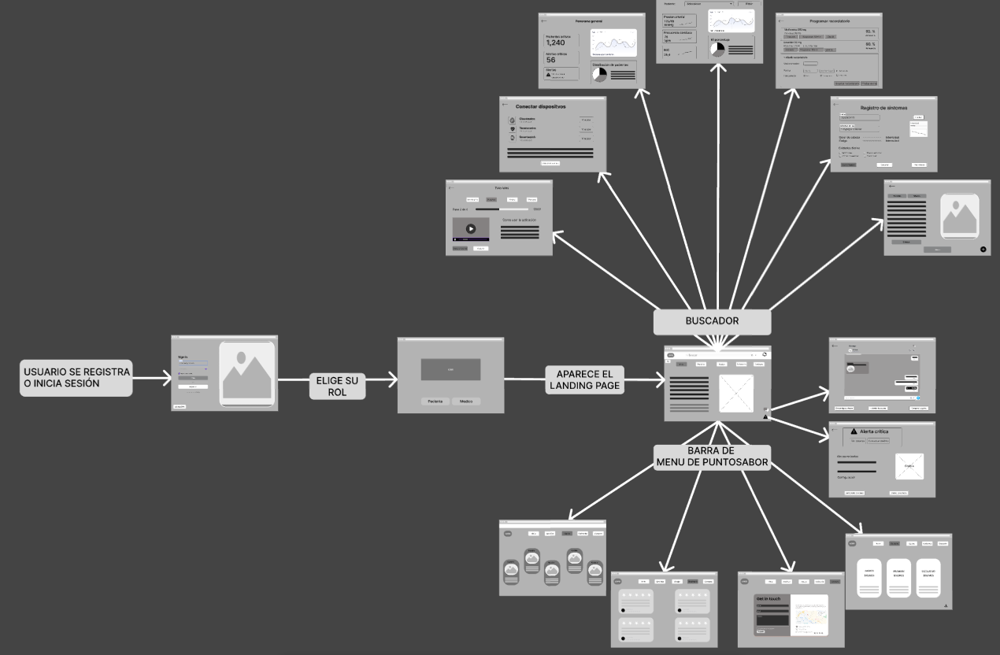

# <center>CHRONICAREE PROJECT</center>

<p align="center">
    <strong>Universidad Peruana de Ciencias Aplicadas</strong><br>
    </img><br>
    <strong>Ingeniería de Software</strong><br>
    <strong>Desarrollo de Aplicaciones Open Source </strong><br>
    <strong>Profesor: Hugo Allan Mori Paiva </strong><br>
    <strong>INFORME TB1  </strong><br>
</p>

<center>

#### Startup: **Chronisys**
#### Product: **ChroniCaree**
### Team  Members:

</center>

<div align="center">

|               Member                |    Code    |
|:-----------------------------------:|:----------:|
|  Alejandro Nicolas Barturen Guzman  | U202214406 |
| Sebastian Martin Beingolea Montalvo | U202217853 |
| Schneider Carlos Delgado Carrasco   | U202321843 |
|    Andreow Jomark Santiago Peña     | U202317362 |
|   Calors Alberto Lopez Goitia       | U202312700 |

</div>

<center>
<br> SEPTIEMBRE 2025
</center> 

# Registro de Versiones del Informe

|version| Fecha      | Autor                               | Descripcion de Modificacion             |
|---|------------|-------------------------------------|-----------------------------------------|
|0.1| 08/09/2025 | Andreow Santiago                    | Creacion y primera version del informe  |
|0.2| 17/09/2025 | Sebastian Martin Beingolea Montalvo | Se añadio el capitulo 1 en su totalidad |
|0.3| 18/09/2025 | Andreow Jomark Santiago Peña, Schneider Carlos Delgado Carrasco, Calors Alberto Lopez Goitia | Se desarrollo el Landing Page 


# Project Report Collaboration Insights

En esta sección, el equipo presenta un análisis detallado de la colaboración realizada durante el desarrollo del informe del proyecto. A continuación, se describe el progreso alcanzado a lo largo de las distintas entregas, destacando tanto el trabajo individual como el esfuerzo colectivo, los commits realizados y las evidencias gráficas del flujo colaborativo en GitHub.

A continuacion, se detalla el trabajo realizado durante cada entrega, acompañado de evidencias visuales de participación en el repositorio del report en GitHub y un resumen de los principales commits realizados por los miembros del equipo.

Link del reporte del equipo: 

https://github.com/UPC-PRE-1ASI0729-7391-ChroniCaree/ChroniCaree-Report

#### TB1

aun no acabamos


# Contenido

[Registro de Versiones del Informe](#registro-de-versiones-del-informe)

[Project Report Collaboration Insights](#project-report-collaboration-insights)

[Student Outcome](#student-outcome)

[Capítulo I: Introducción](#capítulo-i-introducción)

[1.1 Startup Profile](#11-startup-profile)  
[1.1.1. Descripción de la Startup](#111-descripción-de-la-startup)  
[1.1.2. Perfiles de integrantes del equipo](#112-perfiles-de-integrantes-del-equipo)  

[1.2. Solution Profile](#12-solution-profile)  
[1.2.1 Antecedentes y problemática](#121-antecedentes-y-problemática)  
[1.2.2 Lean UX Process.](#122-lean-ux-process)  
[1.2.2.1. Lean UX Problem Statements.](#1221-lean-ux-problem-statements)  
[1.2.2.2. Lean UX Assumptions.](#1222-lean-ux-assumptions)  
[1.2.2.3. Lean UX Hypothesis Statements.](#1223-lean-ux-hypothesis-statements)  
[1.2.2.4. Lean UX Canvas.](#1224-lean-ux-canvas)  

[1.3. Segmentos objetivo.](#13-segmentos-objetivo)  

[Capítulo II: Requirements Elicitation & Analysi](#capítulo-ii-requirements-elicitation--analysis)  

[2.1. Competidores](#21-competidores)  
[2.1.1. Análisis competitivo](#211-análisis-competitivo)  
[2.1.2. Estrategias y tácticas frente a competidores](#211-análisis-competitivo)  

[2.2. Entrevistas](#22-entrevistas)  
[2.2.1. Diseño de entrevistas](#221-diseño-de-entrevistas)  
[2.2.2. Registro de entrevistas](#222-registro-de-entrevistas)  
[2.2.3. Análisis de entrevistas](#223-análisis-de-entrevistas)  

[2.3. Needfinding](#23-needfinding)  
[2.3.1. User Personas](#231-user-personas)  
[2.3.2. User Task Matrix](#232-user-task-matrix)  
[2.3.3. User Journey Mapping](#233-user-journey-mapping)  
[2.3.4. Empathy Mapping](#234-empathy-mapping)  
[2.3.5. As-is Scenario Mapping](#235-as-is-scenario-mapping) 

[2.4. Ubiquitous Language](#24-ubiquitous-language)  

[Capítulo III: Requirements Specificatio](#capítulo-iii-requirements-specification)  

[3.1. To-Be Scenario Mapping](#31-to-be-scenario-mapping)    
[3.2. User Stories](#32-user-stories)  
[3.3. Impact Mapping](#33-impact-mapping)  
[3.4. Product Backlog](#34-product-backlog)  

[Capítulo IV: Product Desig](#capítulo-iv-product-design)  

[4.1. Style Guidelines](#41-style-guidelines)  
[4.1.1. General Style Guidelines](#411-general-style-guidelines)  
[4.1.2. Web Style Guidelines](#412-web-style-guidelines)  

[4.2. Information Architecture](#42-information-architecture)  
[4.2.1. Organization Systems](#421-organization-systems)  
[4.2.2. Labeling Systems](#422-labeling-systems)  
[4.2.3. SEO Tags and Meta Tag](#423-seo-tags-and-meta-tags)  
[4.2.4. Searching Systems](#424-searching-systems)   
[4.2.5. Navigation Systems](#425-navigation-systems)  

[4.3. Landing Page UI Design](#43-landing-page-ui-design)   
[4.3.1. Landing Page Wireframe](#431-landing-page-wireframe)  
[4.3.2. Landing Page Mock-up](#432-landing-page-mock-up) 

[4.4. Web Applications UX/UI Design](#44-web-applications-uxui-design)  
[4.4.1. Web Applications Wireframes](#441-web-applications-wireframes)  
[4.4.2. Web Applications Wireflow Diagrams](#442-web-applications-wireflow-diagrams)  
[4.4.3. Web Applications Mock-ups](#443-web-applications-mock-ups)   
[4.4.4. Web Applications User Flow Diagrams](#444-web-applications-user-flow-diagrams)  

[4.5. Web Applications Prototyping](#45-web-applications-prototyping)  

[4.6. Domain-Driven Software Architecture](#46-domain-driven-software-architecture)  
[4.6.1. Software Architecture Context Diagram](#461-software-architecture-context-diagram)  
[4.6.2. Software Architecture Container Diagrams](#462-software-architecture-container-diagrams)  
[4.6.3. Software Architecture Components Diagrams](#463-software-architecture-components-diagrams)  

[4.7. Software Object-Oriented Design](#47-software-object-oriented-design)  
[4.7.1. Class Diagrams](#471-class-diagrams)  
[4.7.2. Class Dictionary](#472-class-dictionary)  

[4.8. Database Design](#48-database-design)  
[4.8.1. Database Diagram](#481-database-diagram)  

[Capítulo V: Product Implementation, Validation & Deploymen](#capítulo-v-product-implementation-validation--deployment)  

[5.1. Software Configuration Management](#51-software-configuration-management)  
[5.1.1. Software Development Environment Configuration](#511-software-development-environment-configuration)  
[5.1.2. Source Code Management](#512-source-code-management)  
[5.1.3. Source Code Style Guide & Conventions](#513-source-code-style-guide--conventions)  
[5.1.4. Software Deployment Configuration](#514-software-deployment-configuration)  

[5.2. Landing Page, Services & Applications Implementation](#52-landing-page-services--applications-implementation)  
[5.2.1. Sprint 1](#521-sprint-1)  
[5.2.2. Sprint 2 ](#522-sprint-2)  
[5.2.2. Sprint 3 ](#522-sprint-3)  
[5.2.2. Sprint 4 ](#522-sprint-4)  
  
[Bibliografía](#bibliografía)  
[Anexos](#anexos)  

# Student Outcome

| Criterio Específico | Acciones Realizadas |
|---|---|
     


# Capítulo I: Introducción
## 1.1. Startup Profile
### 1.1.1. Descripción de la Startup

Chronisys nace con un propósito claro: transformar el manejo de enfermedades crónicas desde casa, poniendo en manos de pacientes, médicos y administradores de salud una herramienta digital que simplifica el seguimiento, mejora la adherencia al tratamiento y previene complicaciones antes de que ocurran.

Nuestra plataforma, ChroniCaree, permite a los pacientes registrar sus síntomas diarios de forma intuitiva, recibir alertas personalizadas y compartir su evolución en tiempo real con su equipo médico. Para los profesionales de la salud, ofrece paneles de análisis, métricas clínicas y herramientas de intervención temprana. Y para los administradores hospitalarios, brinda visibilidad estratégica sobre el estado general de los pacientes, la carga de trabajo del personal y la efectividad del programa de salud en casa.

Chronisys se dirige a sistemas de salud pública y privada, clínicas especializadas en enfermedades crónicas, médicos de atención primaria y, sobre todo, a pacientes que viven con condiciones como diabetes, hipertensión, EPOC o insuficiencia cardíaca. Creemos que el cuidado continuo no debe depender de visitas presenciales constantes, sino de un sistema inteligente que acompaña, alerta y empodera.

Nuestra propuesta de valor combina tecnología accesible, datos en tiempo real y enfoque humano. Queremos que gestionar una enfermedad crónica sea menos abrumador, más predecible y totalmente personalizado. También ofrecemos a las instituciones de salud una solución escalable para reducir hospitalizaciones, optimizar recursos y mejorar indicadores de calidad de vida.

Misión: Democratizar el autocuidado en enfermedades crónicas, acercando a pacientes y equipos médicos herramientas digitales que permitan un seguimiento proactivo, simple y centrado en la persona.

Visión: Ser la plataforma líder en Latinoamérica para el manejo remoto de enfermedades crónicas, construyendo un ecosistema donde la tecnología y la empatía se unen para prevenir, no solo reaccionar.

En Chronisys trabajamos bajo un modelo centrado en el paciente y basado en evidencia. Apostamos por la inteligencia de datos, la usabilidad extrema y la integración con sistemas de salud existentes. Creemos que el futuro de la medicina crónica está en casa — y estamos construyéndolo.

Más que una app, ChroniCaree by Chronisys es un nuevo estándar de cuidado: donde cada síntoma registrado es un paso hacia la prevención, donde cada alerta evita una emergencia, y donde cada paciente se siente acompañado, incluso a distancia.

#### 1.1.2. Perfiles de integrantes del equipo
| Miembros del equipo                                                                                                                                      | Codigo de estudiante |  |
|----------------------------------------------------------------------------------------------------------------------------------------------------------|----------------------|---|
| Andreow Jomark Santiago Peña  | U202317362           | Soy Andreow Santiago, 19 años, estudiante de Ingeniería de Software en la UPC. Apasionado por la tecnología, el diseño UX/UI y soluciones que impactan. Me gusta aprender rápido, resolver problemas con creatividad y trabajar en equipo. Busco aportar en proyectos innovadores con enfoque humano y propósito real.|   
| Alejandro Nicolas Barturen Guzman                            | U202214406           | Tengo 21 años y estoy en la Carrera de Ingeniería de Software de la Universidad Peruana de Ciencias Aplicadas. Ye tengo experiencia realizando trabajos grupales, me considero alguien bastante eficiente y comunicativo que siempre busca la realización del trabajo de la mejor forma posible   |   
| Sebastian Martin Beingolea Montalvo                           | U202217853           | Comunicación efectiva, trabajo en equipo, empatía, pensamiento crítico, conocimientos básicos de Python y C++. Autodidacta en el aprendizaje de lenguajes de programación.  |   
| Schneider Carlos Alberto Delgado Carrasco                           | U202321843           | Tengo 20 años y estoy en la carrera de Ingeniería de Software. Actualmente estoy en el 5to ciclo de mi carrera, donde vengo desarrollando conocimientos en programación, bases de datos. Me interesa mucho la tecnología, la innovación y cómo las soluciones digitales pueden mejorar la vida de las personas. Estoy comprometido con mi formación y busco siempre nuevos retos que me permitan crecer tanto a nivel académico como personal.      |    
| Carlos Alberto Lopez Goitia                          |U202312700                     | Soy estudiante del quinto ciclo de Ingeniería de Software en la Universidad Peruana de Ciencias Aplicadas. Me apasiona el desarrollo tecnológico y su aplicación en la resolución de problemas reales. Tengo experiencia en programación orientada a objetos, diseño de bases de datos y metodologías ágiles. Me considero una persona analítica, proactiva y comprometida con el trabajo en equipo, siempre enfocado en crear soluciones funcionales, escalables e innovadoras.  |  

# 1.2. Solución Profile
## 1.2.1. Antecedentes y Problemática
**Técnica de The 5 'W's y 2 'H's**

**What (¿Qué?)**

¿Cuál es el problema?

Las enfermedades crónicas como la diabetes, hipertensión y enfermedades cardiovasculares constituyen una de las principales causas de muerte en Perú y América Latina. Según la Organización Panamericana de la Salud (OPS), más del 60% de las muertes en la región están relacionadas con enfermedades crónicas no transmisibles. Sin embargo, el seguimiento de estos pacientes ocurre casi exclusivamente en consultas presenciales espaciadas, impidiendo una vigilancia continua de su salud. Actualmente, los hospitales carecen de herramientas digitales para monitorear diariamente a los pacientes, generar alertas oportunas y facilitar la adherencia terapéutica, lo que aumenta las complicaciones, hospitalizaciones recurrentes y la saturación de los servicios de salud.

**When (¿Cuándo?)**

¿Cuándo sucede el problema?

El problema ocurre constantemente, cada día que los pacientes viven sin un control directo de su médico. La falta de seguimiento se intensifica entre consultas presenciales, cuando el paciente no tiene forma de reportar su evolución ni el médico puede acceder a datos actualizados. Esta brecha genera mayor riesgo de emergencias inesperadas, especialmente en etapas avanzadas de la enfermedad crónica, donde el monitoreo continuo resulta crítico.

**Where (¿Dónde?)**

¿Dónde surge el problema?

Este problema se presenta principalmente en hospitales y clínicas de entornos urbanos de Perú y Latinoamérica, donde la demanda de atención por enfermedades crónicas supera la capacidad instalada. Según el INEI (2024), cerca del 20% de la población peruana vive con al menos una enfermedad crónica. En el sector público, las largas esperas para citas médicas retrasan diagnósticos y tratamientos oportunos; en el privado, los altos costos de consultas frecuentes hacen inviable un control continuo. Tanto en áreas urbanas como rurales, la ausencia de plataformas digitales de monitoreo limita la calidad del cuidado.

**Who (¿Quién?)**

¿Quiénes son los afectados?

- Pacientes con enfermedades crónicas, que necesitan control diario para evitar complicaciones.
- Médicos hospitalarios, que carecen de información continua para tomar decisiones clínicas.
- El sistema de salud en general, que enfrenta mayores costos y sobrecarga por hospitalizaciones evitables.

**Why (¿Por qué?)**

¿Cuál es la causa del problema?

- Falta de sistemas hospitalarios digitales para el monitoreo diario de pacientes crónicos.
- Dependencia de consultas presenciales como único medio de control.
- Escasa disponibilidad de soluciones SaaS adaptadas al contexto hospitalario latinoamericano.
- Baja adherencia terapéutica debido a la ausencia de recordatorios y seguimiento estructurado.
- Saturación de los servicios de salud, que limita la capacidad de realizar controles frecuentes.

**How (¿Cómo?)**

¿Cómo se utilizará el producto?

**ChroniCare** se implementará como una plataforma web y móvil bajo el modelo SaaS, diseñada para hospitales y clínicas:

- **Pacientes**: registrarán diariamente sus síntomas, signos vitales y toma de medicamentos mediante cuestionarios simples y recordatorios automatizados.
- **Médicos**: accederán a un panel de control con información consolidada, recibirán alertas ante valores de riesgo y podrán revisar reportes de evolución clínica.

De esta manera, ChroniCare mejora la adherencia terapéutica, fortalece la comunicación médico–paciente y contribuye a prevenir complicaciones, apoyando la eficiencia hospitalaria.

**How much (¿Cuánto?)**

¿Cuánto costará implementar la solución?

La implementación de **ChroniCare** requiere una inversión inicial para el desarrollo del software, infraestructura en la nube y actividades de despliegue en instituciones de salud. A diferencia de soluciones propietarias o extranjeras de alto costo, el modelo SaaS ofrece un acceso más escalable y sostenible para hospitales peruanos y latinoamericanos.

**Presupuesto estimado:**

**Desarrollo de Software**

- Diseño y desarrollo del dashboard web y aplicación móvil: S/ 5,000 – S/ 7,500
- Backend, API y base de datos segura en la nube: S/ 4,500 – S/ 6,500
- Dominio, hosting y servidores (anual): S/ 1,800 – S/ 2,500

**Infraestructura y Seguridad**

- Implementación de protocolos de seguridad (cifrado, backup): S/ 2,000 – S/ 3,500
- Integración con sistemas hospitalarios básicos: S/ 2,000 – S/ 3,000

**Marketing y Lanzamiento**

- Estrategia digital y materiales institucionales: S/ 2,000 – S/ 3,500
- Alianzas con hospitales y clínicas piloto: S/ 1,500 – S/ 2,500

**Mantenimiento y Soporte (anual)**

- Actualizaciones de software y soporte técnico: S/ 3,500 – S/ 5,000

**Total estimado:** S/ 22,300 – S/ 33,000

## 1.2.2. Lean UX Process
El proceso Lean UX que adoptamos en Cronicare está orientado a maximizar la eficiencia en el desarrollo de nuestro producto, enfocándose en principios fundamentales como la validación continua, el pensamiento crítico y la acción rápida. A partir de esta filosofía, hemos estructurado nuestro propio enfoque Lean UX, 
basado en cuatro componentes esenciales: definición de problemas, formulación de suposiciones, creación de hipótesis y desarrollo de un lienzo estratégico. Aquí se aplica Lean UX Process y abarca la visión del modelo de negocio que será soportado por el producto de software.

### 1.2.2.1. Lean UX Problem Statement
El propósito de Cronicare es transformar el cuidado de pacientes con enfermedades crónicas mediante una solución tecnológica integral. Esta permite a pacientes, familiares y profesionales de la salud monitorear y gestionar de forma continua, segura y personalizada condiciones como diabetes e hipertensión. Buscamos garantizar un cuidado preventivo y proactivo, mejorando la adherencia a tratamientos, facilitando decisiones médicas oportunas y brindando tranquilidad a todos los involucrados.

El problema surge cuando pacientes con enfermedades crónicas, sus familias y médicos no logran mantener un control constante del estado de salud. Los pacientes olvidan tomar medicamentos o asistir a citas, los familiares carecen de información actualizada sobre la evolución de la enfermedad, y los médicos tienen acceso limitado a historiales confiables para sus decisiones. Esta falta de comunicación fluida y herramientas modernas de seguimiento causa complicaciones evitables y reduce la calidad de vida.

Hemos observado que esta situación genera baja adherencia a tratamientos, aumenta las complicaciones médicas, eleva la preocupación familiar y sobrecarga al personal sanitario. La ausencia de una plataforma que integre recordatorios inteligentes, monitoreo remoto y comunicación directa limita la capacidad de ofrecer un cuidado crónico eficiente, accesible y escalable.

Ante esta problemática nos planteamos:

**¿Cómo podríamos crear una solución de monitoreo digital que brinde seguridad, eficiencia y continuidad en el cuidado de pacientes crónicos, integrando datos de salud en tiempo real con herramientas intuitivas y accesibles para pacientes, familias y médicos?**

- **Domain:** Salud digital, cuidado de enfermedades crónicas, telemedicina y monitoreo remoto.
- **Customer Segments:**
    - Pacientes con enfermedades crónicas (diabetes, hipertensión).
    - Familiares y cuidadores responsables del seguimiento.
    - Médicos especialistas y personal de salud en clínicas y centros médicos.
- **Pain Points:**
    - Baja adherencia al tratamiento por falta de recordatorios efectivos.
    - Preocupación familiar ante la falta de información en tiempo real.
    - Acceso limitado de los médicos a datos históricos confiables para la toma de decisiones.
    - Riesgo de complicaciones por ausencia de seguimiento continuo.
- **Gap:** No existe en el mercado una solución que integre monitoreo remoto, recordatorios inteligentes y comunicación directa en una plataforma unificada, accesible y adaptable a distintos contextos de atención.
- **Vision/Strategy:** Ser la plataforma líder en soluciones digitales para la gestión de enfermedades crónicas en Latinoamérica, ofreciendo herramientas innovadoras que prevengan complicaciones, fortalezcan la adherencia terapéutica y mejoren la calidad de vida de los pacientes y sus familias.
- **Initial Segment:** Pacientes diabéticos e hipertensos en Lima Metropolitana con acceso a dispositivos móviles que buscan un seguimiento digital confiable y accesible para mejorar su tratamiento.

### 1.2.2.2. Lean UX Assumptions
### **Business Assumptions**

Creemos que los usuarios necesitan monitorear de forma continua y precisa la salud de pacientes con enfermedades crónicas (diabetes, hipertensión), ya sea individualmente o con apoyo de familiares y médicos tratantes.

Esta necesidad puede satisfacerse con una solución digital integral que combine recordatorios inteligentes de tratamiento, monitoreo remoto de métricas de salud y una plataforma visual (dashboard web y app móvil) que muestre datos en tiempo real de manera clara y accesible.

Nuestros clientes iniciales serán pacientes crónicos y sus familias que buscan mejorar la adherencia terapéutica y sentirse más seguros en el control de la enfermedad, así como clínicas y consultorios especializados que necesitan una herramienta para dar seguimiento a múltiples pacientes.

El valor más importante que un cliente espera de nuestros servicios es la tranquilidad de contar con información actualizada y confiable sobre el estado de salud del paciente, lo que facilita la prevención de complicaciones y una atención oportuna.

Además, el cliente obtendrá recordatorios personalizados, acceso a un historial de salud para consultas médicas, notificaciones en tiempo real y una gestión más eficiente de la información para la toma de decisiones clínicas.

Captaremos a la mayoría de clientes mediante canales digitales (Google Ads, Facebook/Instagram Ads, LinkedIn para médicos), alianzas con clínicas y centros de salud especializados en enfermedades crónicas, y marketing de contenidos enfocado en prevención y autocuidado.

Generaremos ingresos a través de un modelo **Freemium** para usuarios B2C (pacientes y familias) y un modelo de **suscripción mensual** para clientes B2B (clínicas y consultorios).

Nuestra competencia serán aplicaciones de recordatorios médicos o wearables de salud genéricos que no integran monitoreo, historial y comunicación en una sola plataforma específicamente adaptada a enfermedades crónicas.

Nuestra ventaja competitiva será ofrecer una solución que combine recordatorios inteligentes, historial clínico digital y comunicación directa paciente–médico en una interfaz accesible y personalizable.

El mayor riesgo del servicio es la resistencia de los usuarios (especialmente adultos mayores) a la tecnología o la desconfianza en la precisión de los datos. Lo mitigaremos con capacitaciones sencillas, pruebas piloto gratuitas, acompañamiento digital y certificaciones de seguridad en la gestión de datos.

Otro riesgo importante es la falta de conectividad en zonas con acceso limitado a internet. Lo resolveremos mediante almacenamiento local con sincronización automática cuando el dispositivo recupere conexión.
### **User Assumptions**

- **¿Quién es el usuario?**
    - Pacientes crónicos: Personas con diabetes o hipertensión.
    - Familiares o cuidadores: Hijos, cónyuges o encargados.
    - Médicos y personal de salud en clínicas o consultorios.
- **¿Dónde encaja nuestro producto en su vida?**
    - Pacientes: Como parte de su rutina diaria con recordatorios y registro de datos.
    - Familiares: Como herramienta de tranquilidad constante, al mostrar el estado del paciente.
    - Médicos: Como apoyo en el seguimiento de pacientes en consulta externa.
- **¿Qué problemas resuelve nuestro producto?**
    - Baja adherencia al tratamiento.
    - Preocupación familiar.
    - Ineficiencia médica en el seguimiento de pacientes.
    - Prevención limitada de complicaciones.
- **¿Cuándo y cómo se usa nuestro producto?**
    - Pacientes/familias: App móvil usada diariamente para recordatorios, registro de datos y alertas.
    - Clínicas: Dashboard web/tablet para monitorear pacientes, generar reportes y coordinar tratamientos.
- **Características importantes:**
    - Recordatorios inteligentes y personalizables.
    - Dashboard visual con métricas claras.
    - Historial clínico digital.
    - Notificaciones en tiempo real.
    - Reportes descargables.
- **Aspecto y comportamiento esperado:**

  Intuitivo, confiable y accesible, con tipografía clara, botones grandes, colores neutros y alertas críticas en tonos destacados.


### **Feature Assumptions**

- Dashboard visual y amigable.
- Recordatorios y notificaciones automáticas.
- Historial clínico digital.
- Reportes descargables y compartibles.
- Gestión de múltiples pacientes en entornos clínicos.
### 1.2.2.3. Lean UX Hypothesis Statements

- **Hypothesis 01:** Los pacientes y familiares adoptarán Cronicare para mejorar adherencia y seguridad.

  *Éxito:* ≥ 80% de usuarios B2C mantienen suscripción premium tras primer mes.

- **Hypothesis 02:** La plataforma mejorará la eficiencia de médicos y clínicas en el seguimiento de pacientes.

  *Éxito:* ≥ 70% de clínicas mantienen servicio piloto y reportan 20% menos tiempo en seguimiento.

- **Hypothesis 03:** Las funciones de Cronicare facilitarán la prevención de complicaciones y decisiones médicas informadas.

  *Éxito:* ≥ 75% de profesionales de salud confirman utilidad en prevención o mejora de tratamiento.

#### 1.2.2.4. Lean UX Canvas.

## 1.3. Segmentos objetivo
**Pacientes adultos mayores**

**Descripción:**

Personas de la tercera edad con enfermedades crónicas que requieren seguimiento continuo. Este segmento busca una solución sencilla que brinde seguridad en el monitoreo de su salud, reduzca visitas innecesarias a centros médicos y proporcione apoyo constante en su cuidado.

**Características demográficas y comportamiento:**

- Adultos mayores de 60 años con enfermedades crónicas como hipertensión o diabetes.
- Prefieren soluciones simples e intuitivas.
- Valoran la tranquilidad de tener sus signos vitales monitoreados en tiempo real.
- Buscan reducir su dependencia de hospitalizaciones frecuentes.

**Sustento estadístico:**

- En Perú, más del 50% de adultos mayores presenta al menos una enfermedad crónica (Minsa, 2022).
- Según la OMS (2021), la población mayor de 60 años en América Latina se duplicará para el 2050, aumentando la necesidad de soluciones de cuidado digital accesibles.


**Doctores y personal médico**

**Descripción:**

Profesionales de la salud encargados de diagnosticar, monitorear y tratar a los adultos mayores. Este segmento necesita herramientas que permitan acceder a datos en tiempo real, generar reportes históricos y optimizar decisiones médicas de manera ágil y precisa.

**Características demográficas y comportamiento:**

- Médicos generales, geriatras, enfermeras y personal clínico entre 28 y 55 años.
- Manejan datos sensibles y requieren plataformas con seguridad avanzada.
- Prefieren dashboards visuales e informes automáticos que faciliten su trabajo.
- Valoran soluciones que reduzcan la carga de consultas presenciales innecesarias.

**Sustento estadístico:**

- En promedio, un adulto mayor con enfermedades crónicas requiere 7 consultas médicas al año (Sociedad Peruana de Geriatría, 2021).
- El 42% de los profesionales de la salud en Latinoamérica afirma que las herramientas digitales aumentan su capacidad de atención y seguimiento (IDB, 2020).
# Capítulo II: Requirements Elicitation & Analysis
## 2.1. Competidores


### 2.1.1. Análisis competitivo.

### 2.1.2. Estrategias y tácticas frente a competidores.


## 2.2. Entrevistas


### 2.2.1. Diseño de entrevistas.


### 2.2.2. Registro de entrevistas


### 2.2.3. Análisis de Entrevistas


## 2.3. Needfinding

### 2.3.1. User Persona

### 2.3.2. User Task Matrix

### 2.3.3. User Journey Mapping

### 2.3.4. Empathy Mapping

### 2.3.5. As-is Scenario Mapping

## 2.4. Ubiquitous Language

# Capítulo III: Requirements Specification
## 3.1. To-Be Scenario Mapping

## 3.2. User Stories

## 3.3. Impact Mapping

## 3.4. Product Backlog.

## 3.5. Entity Diagram.


# Capítulo IV: Product Design

## 4.1. Style Guidelines

En esta sección se define un repositorio centralizado y debidamente organizado para el uso de todo el equipo, el cual incluye recursos como assets, tipografías y demás elementos necesarios. Su finalidad es asegurar una presentación coherente, estandarizada y alineada en todo el proyecto.

### 4.1.1. General Style Guidelines

Buscamos transmitir **confianza, accesibilidad y modernidad**. Para reflejar la idea de **cuidado continuo, prevención de complicaciones y acompañamiento humano en salud digital**, integramos un logo que combina un **checklist** (seguimiento constante) y un **corazón con cruz médica** (salud y empatía), unidos por una línea fluida que simboliza la conexión entre paciente y médico.

La identidad visual de ChroniCare se construye sobre la base de:

- **Misión:** Brindar a pacientes con enfermedades crónicas una herramienta digital accesible, segura y fácil de usar que les permita monitorear su salud diariamente, fomentar la adherencia a sus tratamientos y fortalecer la comunicación con sus médicos, contribuyendo así a mejorar su calidad de vida.
- **Visión:** Convertirnos en la plataforma líder en Perú para el seguimiento digital de enfermedades crónicas, siendo reconocidos por integrar innovación tecnológica, evidencia médica y una experiencia centrada en el paciente que impacte positivamente en los sistemas de salud y en la vida de millones de personas.

#### Logo

Queremos transmitir una imagen de **confianza, seguridad y tranquilidad** al usuario a través de este diseño, utilizando un logotipo en tonos verde-azulados que refuerzan los conceptos de salud, calma y profesionalismo.


#### Typography

La tipografía debe transmitir **claridad, calidez y profesionalismo**. Por esa razón decidimos usar **Poppins** e **Inter**, ya que combinan un estilo humano y cercano con una alta legibilidad en entornos digitales.

- **Poppins** → Para títulos y mensajes clave (conexión emocional).
- **Inter** → Para párrafos, interfaces y texto funcional (claridad y confianza).


##### Tipografía de Diseño (Font Scale)

| Tipo de Texto | Fuente | Tamaño | Peso |
|---------------|--------|--------|------|
| **Display 1** | Inter | 54px | Bold |
| **Display 2** | Inter | 48px | Bold |
| **Heading 1** | Poppins | 32px | Bold |
| **Heading 2** | Inter | 28px | Bold |
| **Heading 3** | Inter | 24px | SemiBold |
| **Heading 4** | Inter | 20px | SemiBold |
| **Paragraph 1** | Inter | 18px | Bold |
| **Paragraph 2** | Inter | 16px | Bold |
| **Text** | Inter | 16px | Regular |
| **Text Small** | Inter | 12px | Light |

#### Colors

Elegimos los siguientes colores buscando plasmar una paleta que influya **seguridad, calma y profesionalismo**:

- **Base**: `#F5F5F5` → Fondo neutro, limpio y profesional.
- **Muted**: `#CCD0DA` → Gris suave para elementos secundarios.
- **CC Bold Green**: `#36837B` → Verde profundo para estados positivos y acciones principales.
- **CC Green**: `#26B5A6` → Verde vibrante para alertas de éxito y botones CTA.
- **CC Red**: `#E63946` → Rojo para alertas críticas y errores.
- **CC Dark Blue**: `#1A2A33` → Azul oscuro para textos importantes y encabezados.
- **Text Primary**: `#0D0D0D` → Negro para texto principal.
- **Text Secondary**: `#333333` → Gris oscuro para subtítulos.
- **Text Secondary-2**: `#FAFAFF` → Blanco para textos sobre fondos oscuros.
- **Text CC**: `#416072` → Azul grisáceo para etiquetas y estados.
- **Text CC (alerta)**: `#F66D77` → Rosa rojizo para notificaciones de riesgo.


#### Spacing

En este proyecto el espaciado cumple un papel clave para mantener la **legibilidad, accesibilidad y equilibrio visual**. Por ello:

- **Párrafos:** Se añade un espacio de 16px entre líneas y 24px entre párrafos.
- **Elementos interactivos:** 8px–12px de separación entre botones, enlaces u otros componentes.
- **Márgenes y padding:** 16px–24px alrededor del contenido para evitar saturación visual.
- **Base modular:** Sistema de espaciado en múltiplos de 8px para consistencia en todas las vistas.

#### Communication Tone

| Dimensión              | Nivel Adoptado    |
|------------------------|-------------------|
| Divertido/Serio        | Medio-Serio       |
| Formal/Casual          | Semi-Formal       |
| Respetuoso/Irreverente | Muy Respetuoso    |
| Entusiasta/Sereno      | Sereno y Empático |

Decidimos mantener una comunicación **clara, cálida y profesional**, porque este enfoque nos permite conectar de manera efectiva con el público, especialmente en un contexto tan sensible como la salud. Usamos lenguaje humano, evitamos tecnicismos innecesarios y priorizamos la empatía en cada mensaje.


### 4.1.2. Web Style Guidelines

Para garantizar que la plataforma se adapte a diferentes tamaños de pantalla y mantenga una presentación clara y atractiva, se empleará **CSS con el apoyo de media queries**. De esta manera, será posible definir estilos específicos según la resolución del dispositivo. Elementos clave como la barra de navegación y el pie de página se ajustarán automáticamente, ofreciendo una experiencia consistente en cualquier dispositivo.

| Dispositivo     | Ancho mínimo | Ejemplo de uso            |
|-----------------|--------------|----------------------------|
| Mobile          | ≥ 320px      | Teléfonos                  |
| Tablet          | ≥ 768px      | iPad / tablets genéricas   |
| Laptop          | ≥ 1024px     | Monitores y laptops        |
| Wide Screen     | ≥ 1440px     | Pantallas grandes o TV     |

La interfaz prioriza:
- **Jerarquía visual clara**: Alertas y métricas vitales siempre visibles.
- **Acciones prioritarias**: Botones de “Registrar síntomas”, “Ver alertas críticas” y “Comunicar con médico” con alto contraste.
- **Navegación intuitiva**: Menú superior con acceso rápido a Dashboard, Pacientes, Alertas, Reportes y Configuración.
- **Feedback visual**: Chips de estado (verde = estable, amarillo = advertencia, rojo = crítico) y animaciones sutiles para confirmaciones.

## 4.2. Information Architecture

### 4.2.1. Organization Systems

Nuestro propósito es garantizar una **experiencia de usuario coherente, intuitiva y sin fricciones** en la plataforma web y móvil, adaptada a las necesidades de nuestros dos segmentos principales: **pacientes** y **médicos**.

La estructura visual ha sido diseñada estratégicamente para facilitar el **monitoreo continuo, la prevención de complicaciones y la comunicación clínica eficiente**.


#### Flujo de usuario y funcionalidades clave:

1. **Landing Page**: Punto de entrada para nuevos usuarios. Presenta la propuesta de valor, beneficios clave y llamados a acción.
2. **Inicio de Sesión / Registro**:
   - **Crear cuenta manual**: Formulario con datos personales y diagnósticos.
   - **Registro con Google**: Opción rápida y segura.
   - **Validación de identidad**: DNI + selfie para garantizar seguridad.
3. **Dashboard (Paciente)**:
   - Registro diario de síntomas y signos vitales.
   - Recordatorios de medicación.
   - Alertas personalizadas.
   - Conexión con dispositivos médicos.
4. **Dashboard (Médico)**:
   - Vista de pacientes asignados.
   - Filtros por condición y nivel de riesgo.
   - Gráficos de evolución clínica.
   - Generación de reportes en PDF.
5. **Perfil y Preferencias**:
   - Actualización de datos biométricos.
   - Configuración de idioma y accesibilidad.
   - Gestión de notificaciones.
6. **Soporte y Tutoriales**:
   - Guías interactivas.
   - FAQ.
   - Contacto con soporte técnico.

Este flujo permite que los pacientes **se sientan acompañados y empoderados**, y que los médicos **tomen decisiones informadas y oportunas**.

### 4.2.2. Labeling Systems

Los sistemas de etiquetado siguen una estructura clara, consistente y centrada en el lenguaje del usuario. Se evitan tecnicismos y se priorizan verbos de acción y sustantivos comprensibles.

#### Navegación principal (App):

| **Sección**      | **Contenido** |
|------------------|---------------|
| **Inicio**       | Panel principal con métricas clave y alertas activas. |
| **Síntomas**     | Registro diario de fatiga, dolor, glucosa, presión, etc. |
| **Medicación**   | Recordatorios, confirmación de tomas, historial de adherencia. |
| **Dispositivos** | Conexión con glucómetros, tensiómetros, smartwatches. |
| **Alertas**      | Notificaciones de valores anómalos o tendencias de riesgo. |
| **Chat Médico**  | Mensajería segura con historial clínico adjunto. |
| **Reportes**     | Evolución semanal/mensual, exportación en PDF. |
| **Perfil**       | Datos personales, preferencias, accesibilidad, seguridad. |

#### Call to Action (CTA):

- **Para pacientes:** “Registrar síntomas”, “Tomar medicación”, “Conectar dispositivo”, “Hablar con mi médico”.
- **Para médicos:** “Revisar alertas”, “Ver evolución”, “Actualizar plan”, “Generar reporte”.

---

### 4.2.3. SEO Tags and Meta Tags

La **Landing Page** está diseñada para atraer nuevos usuarios, informar sobre la propuesta de valor y generar confianza en la marca. Las etiquetas meta se centran en captar tráfico orgánico de personas interesadas en **gestión de enfermedades crónicas, monitoreo remoto y salud digital**.

```html
<!-- Título de la página -->
<title>ChroniCare – Monitoreo Digital de Enfermedades Crónicas</title>

<!-- Meta descripción -->
<meta name="description" content="ChroniCare es una plataforma digital que conecta pacientes y médicos para mejorar la adherencia al tratamiento, simplificar el seguimiento y prevenir complicaciones en enfermedades crónicas como diabetes e hipertensión.">

<!-- Palabras clave -->
<meta name="keywords" content="salud crónica, monitoreo de pacientes, enfermedades crónicas, diabetes, hipertensión, EPOC, telemedicina, recordatorios de medicación, dispositivos médicos, salud digital, app de salud, cuidado en casa">

<!-- Autor -->
<meta name="author" content="Equipo Chronisys – Startup ChroniCare">

```

### 4.2.4. Searching Systems

La plataforma ChroniCare incorpora sistemas de búsqueda y filtrado inteligentes diseñados para que **pacientes** y **médicos** encuentren la información clínica relevante de forma rápida, precisa y sin esfuerzo cognitivo. Evitamos la sobrecarga de datos y priorizamos la **eficiencia clínica** y la **toma de decisiones proactiva**.

#### Búsqueda global en historial clínico
- Disponible en el dashboard de ambos roles.
- Permite buscar por:
  - **Fecha específica o rango de fechas** (ej: “últimos 7 días”).
  - **Tipo de registro** (síntomas, signos vitales, medicación, notas).
  - **Valor numérico** (ej: “glucosa > 250” o “presión < 90/60”).
  - **Palabras clave** en notas o comentarios (ej: “dolor de cabeza”, “mareo”).

#### Filtros avanzados por contexto clínico
- **Para pacientes:**
  - Filtrar registros por síntoma (fatiga, náuseas, dolor).
  - Ver solo medicamentos tomados o pendientes.
  - Filtrar alertas por nivel de riesgo (bajo, medio, alto).
- **Para médicos:**
  - Filtrar pacientes por condición (diabetes, hipertensión, EPOC).
  - Filtrar por nivel de adherencia (<70%, 70–90%, >90%).
  - Filtrar por tipo de alerta (glucosa, presión, falta de registro).
  - Filtrar por dispositivo conectado (glucómetro, tensiómetro, smartwatch).

#### Panel interactivo con selección visual
- Médicos pueden hacer clic en gráficos de evolución para:
  - Seleccionar un rango de tiempo y ver solo los datos de ese periodo.
  - Comparar métricas entre dos pacientes con condiciones similares.
  - Identificar correlaciones (ej: baja adherencia → aumento de glucosa).

#### Búsqueda en comunicaciones clínicas
- Filtrar mensajes en el chat por:
  - **Tema** (medicación, cita, síntoma, emergencia).
  - **Remitente** (paciente, médico, cuidador).
  - **Estado** (leído, no leído, con archivo adjunto).
  - **Fecha** (hoy, esta semana, este mes).

> **Beneficio clave:** Reduce el tiempo de búsqueda de información crítica de minutos a segundos, evita errores por omisión y permite intervenciones oportunas.

---

### 4.2.5. Navigation Systems

La navegación de ChroniCare está diseñada para ser **intuitiva, consistente y adaptable**, priorizando las tareas más frecuentes y críticas según el rol del usuario. La estructura sigue principios de accesibilidad y usabilidad móvil.

#### Estructura de navegación en la Landing Page

| **Sección**       | **Contenido** |
|-------------------|---------------|
| **Inicio**        | Hero con propuesta de valor, CTA “Regístrate como paciente” / “Regístrate como médico”. |
| **¿Qué es ChroniCare?** | Explica el propósito: monitoreo continuo, prevención de complicaciones, comunicación médico-paciente. |
| **Funcionalidades** | Tarjetas con íconos: Registro de síntomas, Alertas inteligentes, Conexión con dispositivos, Comunicación segura. |
| **Testimonios**   | Citas de pacientes y médicos reales con fotos y roles. |
| **Equipo**        | Fotos, nombres y roles del equipo fundador. |
| **Precios**       | Tabla comparativa: Plan gratuito (básico) vs Plan premium (avanzado) vs Plan institucional (B2B). |
| **Contacto**      | Formulario de contacto, enlaces a soporte, redes sociales y política de privacidad. |

#### Navegación en la Aplicación Web/Móvil (por rol)

##### Para Pacientes (barra inferior)
- **Inicio**: Panel con métricas del día, alertas activas y recordatorios pendientes.
- **Síntomas**: Registro diario con íconos y lenguaje natural (“Hoy me siento pesada”).
- **Medicación**: Lista de medicamentos con horarios y botón de confirmación.
- **Dispositivos**: Conexión y sincronización con glucómetros, tensiómetros, etc.
- **Chat Médico**: Mensajería segura con historial clínico adjunto.

##### Para Médicos (sidebar lateral en web / barra inferior en móvil)
- **Dashboard**: Vista general de pacientes activos, alertas críticas y KPIs.
- **Pacientes**: Lista con filtros por condición, riesgo y adherencia.
- **Evolución**: Gráficos comparativos por paciente o grupo.
- **Alertas**: Bandeja priorizada por nivel de urgencia.
- **Reportes**: Generación y exportación de PDFs clínicos.

#### CTAs estratégicos
- **Color teal (#26B5A6)**: Acciones principales (Registrar síntomas, Enviar mensaje, Generar reporte).
- **Color rojo (#E74C3C)**: Alertas críticas y acciones de emergencia (Llamar al médico, Enviar SOS).
- **Ubicación fija**: Botones flotantes para acciones clave (ej: “Registrar ahora”, “Ver alertas”).

> **Beneficio clave:** Los usuarios completan sus tareas clínicas en menos pasos, con menos errores y mayor confianza, gracias a una navegación centrada en su rol y necesidades reales.

---

## 4.3. Landing Page UI Design

La interfaz de la landing page de ChroniCare es clave para el proyecto, pues constituye la **primera impresión del producto**. Su diseño limpio, moderno y empático transmite **confianza, calma y profesionalismo** —valores esenciales en salud digital—, combinando tipografía clara (Poppins e Inter), colores en tonos teal y blanco, y botones estratégicos que destacan las acciones principales. Esta estructura estética y funcional atrae de inmediato a los visitantes y los impulsa a seguir explorando la plataforma.

### 4.3.1. Landing Page Wireframe

> ** Enlace al prototipo interactivo en Figma:**  
> https://www.figma.com/design/TQT3UEzzMXhelZfd0bPylJ/ChroniCare?node-id=0-1&t=eNHIEflEvJ79drV8-1

Los wireframes representan la estructura básica y funcional de la landing page de **ChroniCare**, sin elementos visuales finales. Su objetivo es definir la jerarquía de contenido, los flujos de navegación y la disposición de componentes clave antes de pasar al diseño visual.

---

#### Header y Hero
  
*Define la primera impresión del usuario: logo, menú de navegación, llamado a acción principal (“Empieza a monitorear tu salud” o “Únete como médico”) y espacio para imagen/video hero. Diseñado para captar atención en menos de 3 segundos y comunicar el valor central: prevención, adherencia y cuidado continuo.*

---

#### ¿Qué es ChroniCare?
  
*Sección explicativa que comunica el propósito de ChroniCare: conectar pacientes y médicos para mejorar la adherencia, prevenir complicaciones y humanizar la salud digital. Incluye iconografía simple y bullets de beneficios clínicos.*

---

#### Testimonios de Usuarios
   
*Muestra citas reales de pacientes y médicos. Construye confianza y empatía. Cada tarjeta incluye foto, nombre, rol y testimonio auténtico (ej: “ChroniCare me ayudó a reducir mis hospitalizaciones en un 40%”).*

---

#### Funcionalidades Clave
  
*Presenta los módulos principales: Registro de síntomas, Alertas personalizadas, Conexión con dispositivos, Comunicación con médico. Usa tarjetas modulares con ícono, título y descripción corta.*

---

#### Impacto Clínico
   
*Visualiza métricas de impacto: “40% más de adherencia”, “30% menos de hospitalizaciones”, “95% de satisfacción de médicos”. Refuerza credibilidad y valor clínico real.*

---

#### Footer
   
*Contiene enlaces legales (Términos, Privacidad), contacto (soporte@chronicare.pe), redes sociales, newsletter y logos de alianzas con instituciones de salud. Es la base de confianza y cierre de la página.*

---

### 4.3.2. Landing Page Mock-up.

Esta sección presenta y explica los Mock-ups del Landing Page, tanto en su versión para Desktop Web Browser como Mobile Web Browser. En la propuesta y la explicación debe evidenciarse la aplicación de los principios, elementos de diseño, diseño inclusivo y arquitectura de información, así como el Design System establecido para los productos digitales.


## 4.4. Web Applications UX/UI Design.

El diseño de experiencia de usuario (UX) y de interfaz de usuario (UI) en aplicaciones web consiste en construir una experiencia digital que resulte clara, práctica y agradable para las personas que la utilizan. La UX se enfoca en identificar las necesidades y expectativas de los usuarios, diseñando flujos de navegación y estructuras de información que hagan más sencilla la interacción. En cambio, la UI aborda la parte visual de la aplicación, como el estilo de los botones, menús y la organización del contenido en pantalla. Cuando ambos enfoques se integran de forma adecuada, se logra un equilibrio entre estética y usabilidad, generando así una experiencia atractiva, funcional y memorable para los usuarios.

### 4.4.1. Web Applications Wireframes.

**Web applications wireframes desktop:**


**Web applications wireframes mobile:**


### 4.4.2. Web Applications Wireflow Diagrams.

Los diagramas de wireflow para aplicaciones web son representaciones visuales que muestran tanto la navegación como la estructura de una aplicación. Estos combinan características de los wireframes y de los diagramas de flujo, ofreciendo una visión clara de cómo los usuarios se desplazan por la plataforma y de qué manera interactúan con sus diferentes funciones. Su utilidad radica en detectar posibles dificultades de usabilidad y en asegurar que la experiencia del usuario sea consistente y eficiente.



### 4.4.3. Web Applications Mock-ups.

### 4.4.4. Web Applications User Flow Diagrams.

## 4.5. Web Applications Prototyping.

Prototipo de la aplicación web ChroniCare en figma:

https://www.figma.com/design/TQT3UEzzMXhelZfd0bPylJ/ChroniCare?node-id=0-1&p=f&t=Ib9FkdgFfRiJHozE-0


## 4.6. Domain-Driven Software Architecture.
### 4.6.1. Software Architecture Context Diagram.


### 4.6.2. Software Architecture Container Diagrams.


### 4.6.3. Software Architecture Components Diagrams.


## 4.7. Software Object-Oriented Design.
### 4.7.1. Class Diagrams.

### 4.7.2. Class Dictionary.

## 4.8. Database Design.
### 4.8.1. Database Diagram.


# Capítulo V: Product Implementation, Validation & Deployment
## 5.1. Software Configuration Management.

### 5.1.1. Software Development Environment Configuration.

### 5.1.2. Source Code Management.

### 5.1.3. Source Code Style Guide & Conventions.

### 5.1.4. Software Deployment Configuration.

## 5.2. Landing Page, Services & Applications Implementation.

## 5.2.1. Sprint 1
### 5.2.1.1. Sprint Planning 1.
### 5.2.1.2. Aspect Leaders and Collaborators.
### 5.2.1.3. Sprint Backlog 1.
### 5.2.1.4. Development Evidence for Sprint Review.
### 5.2.1.5. Execution Evidence for Sprint Review.
### 5.2.1.6. Services Documentation Evidence for Sprint Review.
### 5.2.1.7. Software Deployment Evidence for Sprint Review.
### 5.2.1.8. Team Collaboration Insights during Sprint.
