# 
CHRONICAREE PROJECT

    <strong>Universidad Peruana de Ciencias Aplicadas</strong> 
    </img> 
    <strong>Ingeniería de Software</strong> 
    <strong>Desarrollo de Aplicaciones Open Source </strong> 
    <strong>Profesor: Hugo Allan Mori Paiva </strong> 
    <strong>INFORME TB1  </strong> 

#### Startup: **Chronisys**
#### Product: **ChroniCaree**
### Team  Members:

| Member                               | Code        |
|:--------------------------------------:|:-------------:|
|             |   |
|             |   |
|             |   |
|Andreow Jomark Santiago Peña          | U202317362  |
|             |   |

  SEPTIEMBRE 2025

 

# Registro de Versiones del Informe

|version|Fecha|Autor|Descripcion de Modificacion|
|---|---|---|---|
|0.1| 08/09/2025 | Andreow Santiago | Creacion y primera version del informe |
|0.2|   |   |   |

# Project Report Collaboration Insights

En esta sección, el equipo presenta un análisis detallado de la colaboración realizada durante el desarrollo del informe del proyecto. A continuación, se describe el progreso alcanzado a lo largo de las distintas entregas, destacando tanto el trabajo individual como el esfuerzo colectivo, los commits realizados y las evidencias gráficas del flujo colaborativo en GitHub.

A continuacion, se detalla el trabajo realizado durante cada entrega, acompañado de evidencias visuales de participación en el repositorio del report en GitHub y un resumen de los principales commits realizados por los miembros del equipo.

Link del reporte del equipo: 

https://github.com/UPC-PRE-1ASI0729-7391-ChroniCaree/ChroniCaree-Report

#### TB1

aun no acabamos

# Contenido

[Registro de Versiones del Informe](#registro-de-versiones-del-informe)

[Project Report Collaboration Insights](#project-report-collaboration-insights)

[Student Outcome](#student-outcome)

[Capítulo I: Introducción](#capítulo-i-introducción)

[1.1 Startup Profile](#11-startup-profile)  
[1.1.1. Descripción de la Startup](#111-descripción-de-la-startup)  
[1.1.2. Perfiles de integrantes del equipo](#112-perfiles-de-integrantes-del-equipo)  

[1.2. Solution Profile](#12-solution-profile)  
[1.2.1 Antecedentes y problemática](#121-antecedentes-y-problemática)  
[1.2.2 Lean UX Process.](#122-lean-ux-process)  
[1.2.2.1. Lean UX Problem Statements.](#1221-lean-ux-problem-statements)  
[1.2.2.2. Lean UX Assumptions.](#1222-lean-ux-assumptions)  
[1.2.2.3. Lean UX Hypothesis Statements.](#1223-lean-ux-hypothesis-statements)  
[1.2.2.4. Lean UX Canvas.](#1224-lean-ux-canvas)  

[1.3. Segmentos objetivo.](#13-segmentos-objetivo)  

[Capítulo II: Requirements Elicitation & Analysi](#capítulo-ii-requirements-elicitation--analysis)  

[2.1. Competidores](#21-competidores)  
[2.1.1. Análisis competitivo](#211-análisis-competitivo)  
[2.1.2. Estrategias y tácticas frente a competidores](#211-análisis-competitivo)  

[2.2. Entrevistas](#22-entrevistas)  
[2.2.1. Diseño de entrevistas](#221-diseño-de-entrevistas)  
[2.2.2. Registro de entrevistas](#222-registro-de-entrevistas)  
[2.2.3. Análisis de entrevistas](#223-análisis-de-entrevistas)  

[2.3. Needfinding](#23-needfinding)  
[2.3.1. User Personas](#231-user-personas)  
[2.3.2. User Task Matrix](#232-user-task-matrix)  
[2.3.3. User Journey Mapping](#233-user-journey-mapping)  
[2.3.4. Empathy Mapping](#234-empathy-mapping)  
[2.3.5. As-is Scenario Mapping](#235-as-is-scenario-mapping) 

[2.4. Ubiquitous Language](#24-ubiquitous-language)  

[Capítulo III: Requirements Specificatio](#capítulo-iii-requirements-specification)  

[3.1. To-Be Scenario Mapping](#31-to-be-scenario-mapping)    
[3.2. User Stories](#32-user-stories)  
[3.3. Impact Mapping](#33-impact-mapping)  
[3.4. Product Backlog](#34-product-backlog)  

[Capítulo IV: Product Desig](#capítulo-iv-product-design)  

[4.1. Style Guidelines](#41-style-guidelines)  
[4.1.1. General Style Guidelines](#411-general-style-guidelines)  
[4.1.2. Web Style Guidelines](#412-web-style-guidelines)  

[4.2. Information Architecture](#42-information-architecture)  
[4.2.1. Organization Systems](#421-organization-systems)  
[4.2.2. Labeling Systems](#422-labeling-systems)  
[4.2.3. SEO Tags and Meta Tag](#423-seo-tags-and-meta-tags)  
[4.2.4. Searching Systems](#424-searching-systems)   
[4.2.5. Navigation Systems](#425-navigation-systems)  

[4.3. Landing Page UI Design](#43-landing-page-ui-design)   
[4.3.1. Landing Page Wireframe](#431-landing-page-wireframe)  
[4.3.2. Landing Page Mock-up](#432-landing-page-mock-up) 

[4.4. Web Applications UX/UI Design](#44-web-applications-uxui-design)  
[4.4.1. Web Applications Wireframes](#441-web-applications-wireframes)  
[4.4.2. Web Applications Wireflow Diagrams](#442-web-applications-wireflow-diagrams)  
[4.4.3. Web Applications Mock-ups](#443-web-applications-mock-ups)   
[4.4.4. Web Applications User Flow Diagrams](#444-web-applications-user-flow-diagrams)  

[4.5. Web Applications Prototyping](#45-web-applications-prototyping)  

[4.6. Domain-Driven Software Architecture](#46-domain-driven-software-architecture)  
[4.6.1. Software Architecture Context Diagram](#461-software-architecture-context-diagram)  
[4.6.2. Software Architecture Container Diagrams](#462-software-architecture-container-diagrams)  
[4.6.3. Software Architecture Components Diagrams](#463-software-architecture-components-diagrams)  

[4.7. Software Object-Oriented Design](#47-software-object-oriented-design)  
[4.7.1. Class Diagrams](#471-class-diagrams)  
[4.7.2. Class Dictionary](#472-class-dictionary)  

[4.8. Database Design](#48-database-design)  
[4.8.1. Database Diagram](#481-database-diagram)  

[Capítulo V: Product Implementation, Validation & Deploymen](#capítulo-v-product-implementation-validation--deployment)  

[5.1. Software Configuration Management](#51-software-configuration-management)  
[5.1.1. Software Development Environment Configuration](#511-software-development-environment-configuration)  
[5.1.2. Source Code Management](#512-source-code-management)  
[5.1.3. Source Code Style Guide & Conventions](#513-source-code-style-guide--conventions)  
[5.1.4. Software Deployment Configuration](#514-software-deployment-configuration)  

[5.2. Landing Page, Services & Applications Implementation](#52-landing-page-services--applications-implementation)  
[5.2.1. Sprint 1](#521-sprint-1)  
[5.2.2. Sprint 2 ](#522-sprint-2)  
[5.2.2. Sprint 3 ](#522-sprint-3)  
[5.2.2. Sprint 4 ](#522-sprint-4)  
  
[Bibliografía](#bibliografía)  
[Anexos](#anexos)  

# Student Outcome

| Criterio Específico | Acciones Realizadas |
|---|---|
     

# Capítulo I: Introducción
## 1.1. Startup Profile
### 1.1.1. Descripción de la Startup

Chronisys nace con un propósito claro: transformar el manejo de enfermedades crónicas desde casa, poniendo en manos de pacientes, médicos y administradores de salud una herramienta digital que simplifica el seguimiento, mejora la adherencia al tratamiento y previene complicaciones antes de que ocurran.

Nuestra plataforma, ChroniCaree, permite a los pacientes registrar sus síntomas diarios de forma intuitiva, recibir alertas personalizadas y compartir su evolución en tiempo real con su equipo médico. Para los profesionales de la salud, ofrece paneles de análisis, métricas clínicas y herramientas de intervención temprana. Y para los administradores hospitalarios, brinda visibilidad estratégica sobre el estado general de los pacientes, la carga de trabajo del personal y la efectividad del programa de salud en casa.

Chronisys se dirige a sistemas de salud pública y privada, clínicas especializadas en enfermedades crónicas, médicos de atención primaria y, sobre todo, a pacientes que viven con condiciones como diabetes, hipertensión, EPOC o insuficiencia cardíaca. Creemos que el cuidado continuo no debe depender de visitas presenciales constantes, sino de un sistema inteligente que acompaña, alerta y empodera.

Nuestra propuesta de valor combina tecnología accesible, datos en tiempo real y enfoque humano. Queremos que gestionar una enfermedad crónica sea menos abrumador, más predecible y totalmente personalizado. También ofrecemos a las instituciones de salud una solución escalable para reducir hospitalizaciones, optimizar recursos y mejorar indicadores de calidad de vida.

Misión: Democratizar el autocuidado en enfermedades crónicas, acercando a pacientes y equipos médicos herramientas digitales que permitan un seguimiento proactivo, simple y centrado en la persona.

Visión: Ser la plataforma líder en Latinoamérica para el manejo remoto de enfermedades crónicas, construyendo un ecosistema donde la tecnología y la empatía se unen para prevenir, no solo reaccionar.

En Chronisys trabajamos bajo un modelo centrado en el paciente y basado en evidencia. Apostamos por la inteligencia de datos, la usabilidad extrema y la integración con sistemas de salud existentes. Creemos que el futuro de la medicina crónica está en casa — y estamos construyéndolo.

Más que una app, ChroniCaree by Chronisys es un nuevo estándar de cuidado: donde cada síntoma registrado es un paso hacia la prevención, donde cada alerta evita una emergencia, y donde cada paciente se siente acompañado, incluso a distancia.

#### 1.1.2. Perfiles de integrantes del equipo
| Miembros del equipo | Codigo de estudiante |  |
|---|---|---|
| Andreow Jomark Santiago Peña  |  U202317362 | Soy Andreow Santiago, 19 años, estudiante de Ingeniería de Software en la UPC. Apasionado por la tecnología, el diseño UX/UI y soluciones que impactan. Me gusta aprender rápido, resolver problemas con creatividad y trabajar en equipo. Busco aportar en proyectos innovadores con enfoque humano y propósito real.|   
|   |   |   |   
|   |   |   |   
|   |   |   |    
|   |   |   |  

# 1.2. Solución Profile

## 1.2.1. Antecedentes y Problemática

## 1.2.2. Lean UX Process

### 1.2.2.1. Lean UX Problem Statement

### 1.2.2.2. Lean UX Assumptions

### 1.2.2.3. Lean UX Hypothesis Statements

#### 1.2.2.4. Lean UX Canvas.

## 1.3. Segmentos objetivo

# Capítulo II: Requirements Elicitation & Analysis

## 2.1. Competidores

En esta sección analizaremos a los que consideramos los principales competidores de nuestra solución, que son los siguientes:

**Mediktor**

Mediktor es una plataforma de salud digital que utiliza inteligencia artificial para guiar a los pacientes en la identificación de posibles condiciones médicas mediante cuestionarios interactivos y análisis de síntomas. Está enfocada en brindar un primer nivel de orientación médica y optimizar el triaje digital, siendo usada en hospitales, aseguradoras y servicios de telemedicina.

**Binahai**

Binahai es una solución de salud digital que permite medir signos vitales como frecuencia cardíaca, frecuencia respiratoria, saturación de oxígeno y niveles de estrés, a través de la cámara de un smartphone o laptop. Su propuesta se centra en la accesibilidad y la escalabilidad, al eliminar la necesidad de dispositivos médicos externos, y está orientada a empresas de seguros, telemedicina y monitoreo remoto de pacientes.

**Welldoc (BlueStar)**

Welldoc es una empresa especializada en el manejo digital de enfermedades crónicas, principalmente diabetes. Su aplicación BlueStar combina registro de datos, recomendaciones personalizadas y reportes para médicos, con un fuerte enfoque en mejorar la adherencia terapéutica y el control glucémico. La plataforma está validada clínicamente y ha sido adoptada en sistemas de salud y aseguradoras de Estados Unidos.

### 2.1.1. Análisis competitivo.

<table>
  <tr>
   <td colspan="6" >Competitive Analysis Landscape
   </td>
  </tr>
  <tr>
   <td rowspan="2" >¿Por qué llevar a

cabo este análisis?
   </td>
   <td colspan="5" >Escriba en el recuadro la pregunta que busca responder o el objetivo de este análisis
   </td>
  </tr>
  <tr>
   <td colspan="5" >Identificar fortalezas, debilidades, oportunidades y amenazas de ChroniCare en comparación con competidores globales
   </td>
  </tr>
  <tr>
   <td colspan="2" >(En la cabecera colocar por

cada competidor nombre y

logo
   </td>
   <td>

 

Chronisys
   </td>
   <td>
       

Welldoc
   </td>
   <td>

Livongo
   </td>
   <td>

lark
   </td>
  </tr>
  <tr>
   <td rowspan="2" >Perfil
   </td>
   <td>Overview
   </td>
   <td>Software  peruano para instituciones de salud que atienden pacientes con enfermedades crónicas. Es para mejorar el monitoreo y comunicación clínica.
   </td>
   <td>Plataforma aprobada por la FDA(Food and Drug Administration) para manejo de diabetes y otras enfermedades crónicas 
   </td>
   <td>Plataforma digital de salud diseñada para ayudar a pacientes con enfermedades crónicas a gestionar su condición . Integra dispositivos médicos conectados
   </td>
   <td>Startup de salud digital de EE. UU. especializada en asesoramiento digital con IA para prevención y manejo de crónicas.
   </td>
  </tr>
  <tr>
   <td>Ventaja

competitiva

¿Qué valor ofrece

a los clientes?
   </td>
   <td>-Accesibilidad y simplicidad. 

-Enfoque institucional . 

-Adaptabilidad a necesidades locales.
   </td>
   <td>-Primera app para diabetes aprobada por la FDA como dispositivo médico. 

-Reconocimiento clínico.
   </td>
   <td>-Ecosistema completo: dispositivos médicos conectados + asesoramiento humano + aplicación..
   </td>
   <td>-Uso de IA conversacional escalable, permite llegar a millones de usuarios con mínimo personal humano.
   </td>
  </tr>
  <tr>
   <td rowspan="2" >Perfil de Marketing
   </td>
   <td>Mercado objetivo
   </td>
   <td>-Clínicas, hospitales y centros de salud que atienden enfermedades crónicas.
   </td>
   <td>-Principalmente pacientes con diabetes pero también sirve para otras enfermedades crónicas

-médicos en EE. UU.

-Aseguradora.
   </td>
   <td> -Aseguradoras

 

-Sistemas de salud grandes.
   </td>
   <td>-Aseguradoras

–Usuarios interesados en prevención de enfermedades.
   </td>
  </tr>
  <tr>
   <td>Estrategias de

marketing
   </td>
   <td>-Alianzas con instituciones, 

-Difusión en congresos médicos,
   </td>
   <td>-Validación científica

-Alianzas con aseguradoras 

-Promoción en congresos médicos.
   </td>
   <td>-Integración con grandes empresas

-Seguros de salud.
   </td>
   <td>Partnerships con aseguradoras y empresas, marketing digital en EE. UU.
   </td>
  </tr>
  <tr>
   <td rowspan="3" >Perfil de Producto
   </td>
   <td>Productos &

Servicios
   </td>
   <td>Chornicare
   </td>
   <td>Welldoc
   </td>
   <td>-Livongo for Diabetes 

-Livongo for Hypertension 

-Livongo for Weight Management, 

-Livongo for Behavioral Health.
   </td>
   <td>-Lark Diabetes Care

-Lark Weight Management

-Lark Hypertension Program
   </td>
  </tr>
  <tr>
   <td>Precios & Costos
   </td>
   <td>Modelo Saas Por suscripción 
   </td>
   <td> Modelo B2B(Business to Business) a aseguradoras.
   </td>
   <td> B2B
   </td>
   <td>Modelo SaaS, B2B.
   </td>
  </tr>
  <tr>
   <td>Canales de

distribución (Web

y/o Móvil
   </td>
   <td> Web + Móvil
   </td>
   <td>Móvil.
   </td>
   <td>Web Móvil
   </td>
   <td>Móvil
   </td>
  </tr>
  <tr>
   <td rowspan="5" >Análisis SWOT
   </td>
   <td colspan="5" >Realice esto para su startup y sus competidores. Sus fortalezas deberían apoyar sus oportunidades y contribuir a lo que ustedes definen como su posible ventaja competitiva
   </td>
  </tr>
  <tr>
   <td>Fortalezas
   </td>
   <td>-Costos accesibles, simplicidad de uso,

 

-alineación con las necesidades de cada paciente. \

   </td>
   <td>-Aprobación FDA

- fuerte reputación.
   </td>
   <td>-Integración hardware + software

 

-Fuerte red de aseguradoras.
   </td>
   <td>-IA escalable

-bajo costo, 

-disponibilidad 24/7.
   </td>
  </tr>
  <tr>
   <td>Debilidades
   </td>
   <td>-Startup en etapa inicial

-Sin certificaciones internacionales
   </td>
   <td>-Alto costo

-Enfoque limitado en EE. UU.
   </td>
   <td>-Elevado costo, 

Dependencia de grandes contratos.
   </td>
   <td>-Menor interacción humana

-Posible falta de personalización en casos complejos.
   </td>
  </tr>
  <tr>
   <td>Oportunidades
   </td>
   <td>-Crecimiento del mercado digital de salud

-Aumento de preocupación por la salud
   </td>
   <td>-Expansión internacional
   </td>
   <td>-Integración con más dispositivos.
   </td>
   <td>-Expansión a mercados globales

-Creciente interés en prevención digital.
   </td>
  </tr>
  <tr>
   <td>Amenazas
   </td>
   <td>-Competidores globales entrando en el mercado

-Barreras regulatorias en salud digital.
   </td>
   <td>-Regulaciones en mercados externos

-Aparición de apps de bajo costo.
   </td>
   <td>-Competencia de apps más accesibles

-Presión en reducción de costos de aseguradoras.
   </td>
   <td>-Desconfianza en chatbots

-Eegulaciones en uso de IA en salud.
   </td>
  </tr>
</table>

### 2.1.2. Estrategias y tácticas frente a competidores.

**Estrategia de alianzas institucionales**

- Establecer convenios con hospitales, clínicas y ministerios de salud para convertir a ChroniCare en la herramienta oficial de monitoreo de enfermedades crónicas. 

- Ofrecer pruebas piloto gratuitas en instituciones de salud para mostrar los beneficios y recopilar evidencia científica local, algo que Welldoc y Livongo no tienen en la región. 

**Estrategia de diferenciación por accesibilidad**

- Mantener precios accesibles mediante el modelo SaaS y ofrecer planes escalables según el tamaño de la institución 

**Estrategia de innovación tecnológica adaptada**

- Incorporar un sistema básico de IA para recordatorios y seguimiento de síntomas, pero siempre complementado con interacción humana para diferenciarse de Lark (que se percibe como impersonal). 

**Estrategia de construcción de confianza**

- Publicar constantemente los avances y mejoras  que la app vaya obteniendo para dar una imagen de transparencia y compromiso con la seguridad de los pacientes. 

- Participar en congresos médicos nacionales e internacionales presentando casos de éxito en instituciones,, para reforzar credibilidad frente a soluciones globales.

## 2.2. Entrevistas

En esta sección se presenta la investigación cualitativa realizada mediante entrevistas profundas a representantes de nuestros dos segmentos objetivo: **pacientes con enfermedades crónicas (Segmento 1)** y **médicos y personal de salud encargado de su seguimiento (Segmento 2)**. El objetivo es comprender sus necesidades reales, frustraciones diarias, hábitos de manejo de la enfermedad y expectativas frente a una plataforma digital de monitoreo continuo, validando así los supuestos del modelo de negocio y ajustando la propuesta de valor de **ChroniCare** a lo que el mercado realmente demanda.

### 2.2.1. Diseño de entrevistas.

Esta sección incluye preguntas demográficas, conductuales y psicográficas dirigidas a cada segmento, con el fin de construir arquetipos (personas) basados en evidencia real. Se aplican buenas prácticas de diseño de entrevistas: preguntas abiertas, no sugestivas, orden lógico (de lo general a lo específico) y enfoque en comportamientos reales, no hipotéticos.

Antes de realizar las entrevistas profundas, se aplicó un formulario digital (Google Forms) a todos los participantes con el objetivo de recolectar información demográfica y conductual básica. Esto permitió segmentar adecuadamente a los entrevistados, personalizar el enfoque de cada entrevista según su perfil, y optimizar el tiempo durante las sesiones cualitativas.

> **Formulario Segmento 1: Pacientes con enfermedades crónicas**  
> https://forms.gle/bMhsNAhPUvH1bYGr5  
>  
> **Formulario Segmento 2: Médicos y personal médico**  
> https://forms.gle/N61b8sb6XsN7CRoY7

---

### Segmento 1: Pacientes con enfermedades crónicas

#### **Demográficas (para arquetipo)**

1. ¿Cuál es tu nombre completo?  
2. ¿Qué edad tienes?  
3. ¿En qué distrito resides?  
4. ¿Cuál es tu género?  
5. ¿Cuál es tu estado civil?  
6. ¿Con quién vives actualmente (solo, con pareja, hijos, familiares, cuidadores)?  
7. ¿A qué te dedicas principalmente (jubilado, ama de casa, empleado, independiente, otro)?  

#### **Psicográficas y comportamentales (para arquetipo)**

8. ¿Cómo describirías tu personalidad cuando se trata de usar tecnología para tu salud (precavido, curioso, reacio, dependiente de otros, entusiasta)?  
9. ¿Qué marcas, apps o servicios digitales de salud confías más? ¿Por qué?  
10. ¿Qué personas, influencers, canales o redes sociales te influyen a la hora de tomar decisiones sobre tu salud?  
11. ¿Qué dispositivos usas con más frecuencia (celular, tablet, computadora)? ¿Qué apps o navegadores prefieres?  
12. ¿Por qué canales digitales sueles informarte o resolver dudas sobre tu salud (WhatsApp, llamadas, Facebook, YouTube, Google, foros médicos)?  

#### **Necesidades y comportamiento (preguntas principales para entrevista cualitativa)**

13. ¿Qué enfermedad crónica estás tratando actualmente y desde cuándo?  
14. ¿Con qué frecuencia visitas a tu médico para controles regulares?  
15. ¿Cómo registras actualmente la toma de tus medicamentos o síntomas diarios (agenda, notas, apps, memoria)?  
16. ¿Has enfrentado situaciones de riesgo (descompensaciones, olvidos de medicación) que te hubiera gustado prevenir? Cuéntame qué pasó.  
17. ¿Qué haces cuando experimentas síntomas fuera de lo normal? ¿Buscas ayuda inmediata o esperas?  
18. ¿Qué información en tiempo real consideras más valiosa recibir sobre tu tratamiento (recordatorios, alertas de valores anormales, consejos, contacto con médico)?  
19. ¿Qué tan cómodo te sentirías usando una aplicación para registrar tus síntomas y medicación? ¿Qué te daría confianza para usarla?  
20. ¿Qué funcionalidades consideras imprescindibles para confiar en una solución como ChroniCare (voz, botones grandes, ayuda de familiares, notificaciones por SMS)?  
21. ¿Qué barreras podrían impedirte usar una aplicación de este tipo (dificultad tecnológica, miedo a errores, desconfianza en datos, costo, falta de internet)?  
22. ¿Qué tan dispuesto estarías a pagar por una herramienta que te ayude a llevar un mejor control de tu salud? ¿Qué rango de precio considerarías justo?  
23. ¿Te gustaría que tu médico o clínica te recomiende esta app? ¿Crees que eso aumentaría tu confianza?

---

### Segmento 2: Médicos y personal médico

#### **Demográficas (para arquetipo)**

1. ¿Cuál es tu nombre completo?  
2. ¿Qué edad tienes?  
3. ¿En qué distrito o institución trabajas principalmente?  
4. ¿Cuál es tu género?  
5. ¿Cuál es tu estado civil?  
6. ¿Con quién vives actualmente?  
7. ¿Cuál es tu ocupación principal y especialidad médica?  

#### **Psicográficas y comportamentales (para arquetipo)**

8. ¿Cómo describirías tu actitud hacia la adopción de tecnología en tu práctica clínica (innovador, escéptico, pragmático, dependiente de la institución)?  
9. ¿Qué marcas, sistemas o plataformas digitales de salud confías o usas habitualmente? ¿Por qué?  
10. ¿Qué colegas, sociedades médicas, influencers o canales te influyen en la adopción de nuevas herramientas?  
11. ¿Qué dispositivos usas con más frecuencia para gestionar información clínica (computadora, tablet, celular)? ¿Qué apps o navegadores prefieres?  
12. ¿Por qué canales digitales sueles comunicarte con pacientes o colegas (correo, WhatsApp, plataforma hospitalaria, llamadas, mensajes de texto)?  

#### **Necesidades y comportamiento (preguntas principales para entrevista cualitativa)**

13. ¿Cuántos pacientes con enfermedades crónicas atiendes semanalmente en promedio?  
14. ¿Qué sistemas de registro o monitoreo de pacientes utilizas actualmente en tu hospital o clínica?  
15. ¿Qué dificultades enfrentas en el seguimiento y control de pacientes con enfermedades crónicas (falta de datos, no adherencia, saturación, comunicación)?  
16. ¿Con qué frecuencia enfrentas emergencias o complicaciones por falta de adherencia terapéutica o descompensaciones? ¿Podrían haberse prevenido?  
17. ¿Cómo coordinas actualmente con tus pacientes o sus familiares sobre su estado de salud?  
18. ¿Qué información en tiempo real te resultaría más útil para mejorar la atención y prevención (tendencias de glucosa, presión, adherencia a medicación, alertas automáticas)?  
19. ¿Qué impacto tendría en tu labor contar con reportes digitales y alertas inmediatas de tus pacientes crónicos? ¿Reduciría consultas innecesarias?  
20. ¿Qué tan dispuesto estarías a utilizar una plataforma como ChroniCare en tu práctica clínica? ¿Qué necesitarías para confiar en los datos que reportan los pacientes?  
21. ¿Qué funcionalidades médicas consideras esenciales (dashboard visual, exportar PDF, integración con historia clínica, alertas personalizables, notificaciones por gravedad)?  
22. ¿Qué obstáculos podrían dificultar la adopción de esta plataforma en tu hospital o clínica (resistencia del personal, falta de infraestructura, costo, privacidad de datos)?  
23. ¿Consideras que los hospitales deberían cubrir el costo de la solución como parte de su servicio a pacientes crónicos? ¿Por qué?

### 2.2.2. Registro de entrevistas

En este apartado se presenta una documentación detallada de cada entrevista realizada con los distintos segmentos objetivo identificados. Se ha recopilado información relevante que incluye el perfil del entrevistado, las respuestas proporcionadas durante la conversación, así como los hallazgos más destacados obtenidos a partir de sus opiniones y experiencias.

> **Video de todas las entrevistas:** https://upcedupe-my.sharepoint.com/:v:/g/personal/u202317362_upc_edu_pe/EdSJhlxr6jxLmiYWVuHKKuQBc47NmPq1z6p2JyT-71hEhA?e=WGaeMs&nav=eyJyZWZlcnJhbEluZm8iOnsicmVmZXJyYWxBcHAiOiJTdHJlYW1XZWJBcHAiLCJyZWZlcnJhbFZpZXciOiJTaGFyZURpYWxvZy1MaW5rIiwicmVmZXJyYWxBcHBQbGF0Zm9ybSI6IldlYiIsInJlZmVycmFsTW9kZSI6InZpZXcifX0%3D

---

## Segmento 1: Pacientes con enfermedades crónicas

### Entrevistado 1: Alisa Goicochea
**Edad:** 21 años  
**Ocupación:** Diseñadora gráfica freelance  
**Distrito:** Miraflores  
**Dispositivos utilizados:** iPhone, MacBook  
**Navegador habitual:** Safari  
**Enfermedad crónica:** Esclerosis Múltiple (diagnóstico hace 2 años)  

**Instante en el que inicia:** 0:00  
**Duración de la entrevista:** 3:24 min

#### Resumen:
Alisa es una joven creativa, digital native y autogestiva. Maneja su enfermedad con herramientas digitales y comunidades en línea. Aunque su vida profesional es intensa, ha aprendido a integrar el autocuidado mediante apps y redes sociales. Su mayor frustración: que la gente minimice su condición porque “no se ve”.

#### Personalidad y Comportamiento:
- Creativa, introspectiva, con sentido del humor ácido.
- Usa metáforas cotidianas para describir su salud (“modo flow”, “día pesado”).
- Valora la autonomía: “Quiero entender mi cuerpo sin que un formulario me juzgue”.

#### Tecnología y Canales de Interacción:
- Usa **HealthKit** y **Notion** como diario de síntomas con emojis y lenguaje personal.
- **TikTok** como fuente de empatía y aprendizaje (ve casos similares).
- **Safari** por integración nativa con su ecosistema Apple.
- Odia los formularios clínicos rígidos: “Quiero hablarle a la app, no llenar casillas”.

#### Hallazgos clave para arquetipo:
- Necesita una app con **IA conversacional** que entienda lenguaje natural (“hoy me siento pesada”).
- Prioriza **diseño estético, dark mode y privacidad** sobre funcionalidades médicas complejas.
- Dispuesta a pagar **hasta S/30/mes** si la app se siente “cool, no clínica”.
- Quiere **compartir datos con su médico solo si ella lo decide**.

---

### Entrevistado 2: Claudia Sifuentes
**Edad:** 24 años  
**Ocupación:** Camarera + Estudiante de Nutrición (UPC)  
**Distrito:** Villa El Salvador  
**Dispositivos utilizados:** iPhone  
**Navegador habitual:** Chrome  
**Enfermedad crónica:** Asma persistente  

**Instante en el que inicia:** 3:24  
**Duración de la entrevista:** 2:47 min

#### Resumen:
Claudia es práctica, resiliente y con fuerte sentido de autoprotección. Maneja su asma con herramientas simples pero efectivas, y depende de su red de apoyo (grupo de WhatsApp, farmacéutica). Su mayor miedo: quedarse sin inhalador en un entorno hostil.

#### Personalidad y Comportamiento:
- Directa, concreta, sin dramatismos.
- Usa frases de acción: “mando un ‘estoy mal’”, “llamo a mi hermano”.
- Valora lo funcional sobre lo formal: “Si no funciona sin datos, no sirve”.

#### Tecnología y Canales de Interacción:
- Usa **Respira (MINSA)**, **WhatsApp con farmacéutica** y **TikTok** para tips.
- Registra síntomas en **Notas del iPhone** con contexto real (“Hoy en el mercado → tos fuerte”).
- **Chrome** solo para búsquedas puntuales (recetas, yoga).
- Desconfía de apps que piden “demasiados permisos”.

#### Hallazgos clave para arquetipo:
- Necesita **alertas contextuales** (“hay polen en tu zona”, “lleva inhalador”).
- Requiere **modo offline** y bajo consumo de datos.
- Valora la posibilidad de **compartir estado con familiares de forma selectiva**.
- Límite de pago: **S/10/mes**, pero “si evita ir al hospital, vale la pena”.

---

### Entrevistado 3: Mauricio Salas
**Edad:** 23 años  
**Ocupación:** Estudiante de Enfermería (UPCH)  
**Distrito:** Lince  
**Dispositivos utilizados:** iPhone  
**Navegador habitual:** Chrome  
**Enfermedad crónica:** Diabetes tipo 1  

**Instante en el que inicia:** 6:34  
**Duración de la entrevista:** 2:46 min

#### Resumen:
Mauricio es un paciente proactivo, con mentalidad clínica por su carrera. Usa tecnología de punta (sensor continuo, MySugr) pero exige que las apps sean divertidas, no solo funcionales. Su mayor riesgo: hipoglucemias en entornos sociales.

#### Personalidad y Comportamiento:
- Irreverente, con humor autocrítico (“Fue épico”).
- Técnico pero emocional: quiere stickers y memes, no solo gráficos de glucosa.
- Usa la tecnología como red de seguridad social (“mi novia recibe alertas”).

#### Tecnología y Canales de Interacción:
- **MySugr** como app principal, con integración de alertas a su pareja.
- **Telegram** para comunidad de apoyo (“Diabéticos Jóvenes Perú”).
- **Chrome** solo para búsquedas serias; el 90% de su gestión es por apps.
- Rechaza apps que “no tienen dark mode” o “te tratan como paciente débil”.

#### Hallazgos clave para arquetipo:
- Exige **integración con dispositivos médicos** (sensores, bombas).
- Quiere **alertas predictivas** (“vas a tener hipoglucemia en clase de bioquímica”).
- Valora el **diseño gamificado** (stickers, logros, memes).
- Dispuesto a pagar **hasta S/20/mes** si la app es “buena y no aburrida”.

---

## Segmento 2: Médicos y personal médico

### Entrevistado 4: Mathias Peña
**Edad:** 25 años  
**Ocupación:** Médico internista (recién egresado)  
**Distrito:** Lince  
**Dispositivos utilizados:** iPhone, Laptop  
**Navegador habitual:** Chrome  

**Instante en el que inicia:** 9:21  
**Duración de la entrevista:** 3:28 min

#### Resumen:
Matías representa a la nueva generación de médicos: digital, pragmático y enfocado en eficiencia. Usa herramientas no oficiales (Google Sheets) porque los sistemas hospitalarios son lentos. Cree firmemente en la prevención proactiva.

#### Personalidad y Comportamiento:
- Analítico, orientado a resultados, con visión de sistema.
- Usa analogías de costos: “Un paciente en urgencias cuesta S/800, una app S/10”.
- Cree en la tecnología como inversión, no gasto.

#### Tecnología y Canales de Interacción:
- Usa **Google Sheets** para seguimiento de pacientes (porque el sistema hospitalario es lento).
- **WhatsApp** para emergencias, **correo institucional** para formalidades.
- **Chrome** por versatilidad y velocidad.
- Valora **alertas automatizadas** (“paciente X no habló en 2 horas”).

#### Hallazgos clave para arquetipo:
- Necesita **alertas inteligentes y priorizadas**.
- Quiere **integración mínima con sistemas hospitalarios**.
- Considera que **los hospitales deben pagar la app** (ROI claro: evita hospitalizaciones).
- Dispuesto a adoptar si reduce carga administrativa y mejora toma de decisiones.

---

### Entrevistado 5: Ana López
**Edad:** No especificada (médico con 5 años de experiencia)  
**Ocupación:** Médico de Medicina Interna (hospital público)  
**Distrito:** No especificado  
**Dispositivos utilizados:** Computadora hospitalaria, celular  
**Navegador habitual:** Chrome (con restricciones institucionales)

**Instante en el que inicia:** 12:49  
**Duración de la entrevista:** 9:10 min

#### Resumen:
Ana es una profesional experimentada en entorno público, donde la burocracia y la fragmentación de sistemas son la norma. Maneja información dispersa (papel, Excel, sistema electrónico) y valora soluciones que unifiquen y prioricen.

#### Personalidad y Comportamiento:
- Metódica, con lenguaje técnico preciso (“umbrales de alerta”, “tendencias semanales”).
- Frustrada por la “información dispersa” y el “tiempo limitado en consulta”.
- Orientada a protocolos y evidencia.

#### Tecnología y Canales de Interacción:
- Usa **historia clínica electrónica institucional**, **Excel** y **documentos en papel**.
- **Chrome** (aunque con restricciones del hospital).
- Comunicación con pacientes: **teleconsulta y llamadas** (evita mensajería personal).
- Valora umbrales clínicos claros: glucosa >250 mg/dL, presión >160/100 mmHg.

#### Hallazgos clave para arquetipo:
- Necesita **umbrales de alerta personalizables y basados en guías clínicas**.
- Requiere **integración con sistemas hospitalarios existentes** (aunque sean básicos).
- Valora **reportes visuales y exportables** (PDF, gráficos de tendencia).
- Mayor barrera: **brecha digital de pacientes y tiempo clínico limitado**.

---

### Entrevistado 6: Daniela Arana
**Edad:** No especificada (enfermera con 3 años de experiencia)  
**Ocupación:** Licenciada en Enfermería (Medicina Interna)  
**Distrito:** No especificado  
**Dispositivos utilizados:** Computadora hospitalaria, iPhone  
**Navegador habitual:** Chrome  

**Instante en el que inicia:** 23:16  
**Duración de la entrevista:** 4:37 min

#### Resumen:
Daniela es una enfermera empática, orientada al acompañamiento y la educación. Ve la tecnología como una herramienta para “evitar apagar incendios” y dedicar más tiempo a la prevención y el vínculo humano.

#### Personalidad y Comportamiento:
- Cálida, con enfoque en el paciente como persona.
- Usa frases de cuidado: “evitar sufrimiento”, “acompañar en lugar de apagar incendios”.
- Pragmática: adoptaría la app si es “fácil de usar y me ayuda en el trabajo”.

#### Tecnología y Canales de Interacción:
- Usa **sistema hospitalario básico**, **WhatsApp con colegas y familiares de pacientes**.
- **Chrome** en todos sus dispositivos.
- Valora **registro simple de signos vitales** y **alertas automáticas**.

#### Hallazgos clave para arquetipo:
- Necesita una app **móvil-first, intuitiva y rápida de usar en entornos clínicos**.
- Funcionalidades esenciales: **registro de signos vitales, alertas, recordatorios de medicación**.
- Valora **reportes fáciles de leer para pacientes y familiares**.
- Disposición a adoptar si reduce carga y mejora resultados.

---

### 2.2.3. Análisis de Entrevistas

## 2.3. Needfinding

### 2.3.1. User Persona

Segmento Objetivo: Pacientes con enfermedades crónica

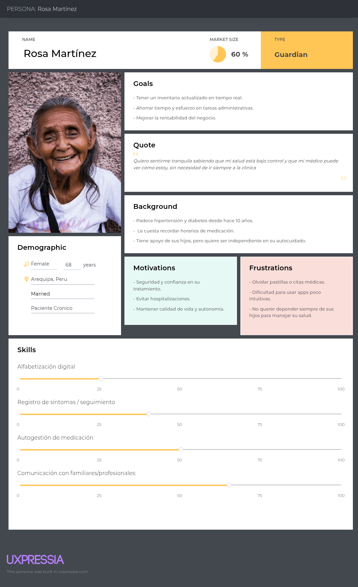

Segmento Objetivo: Doctores y personal médico

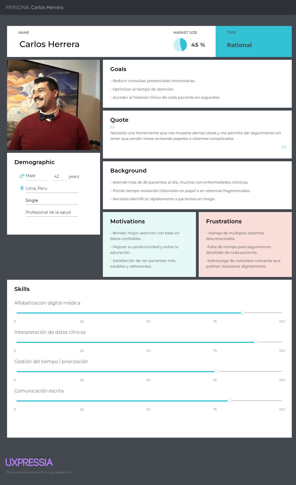

Segmento Objetivo: Administradores de instituciones de salud

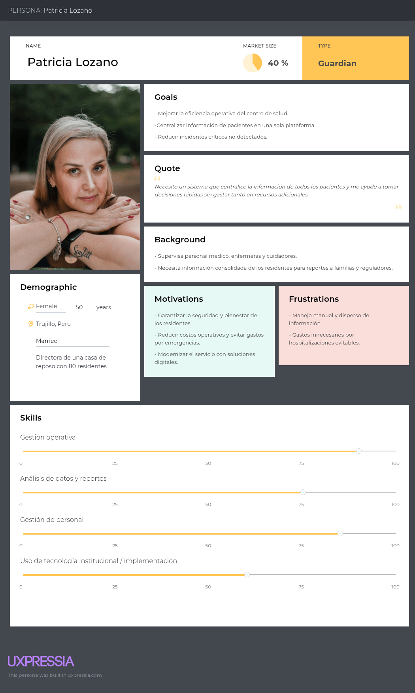

### 2.3.2. User Task Matrix

Segmento Objetivo: Pacientes adultos mayores

<table>
  <tr>
   <td><strong>User Task</strong>
   </td>
   <td><strong>Frecuencia</strong>
   </td>
   <td><strong>Importancia</strong>
   </td>
  </tr>
  <tr>
   <td>Iniciar sesión
   </td>
   <td>Multiple
   </td>
   <td>High
   </td>
  </tr>
  <tr>
   <td>Registrar signos vitales (PA, glucosa, etc.)
   </td>
   <td>Multiple
   </td>
   <td>High
   </td>
  </tr>
  <tr>
   <td>Responder cuestionario de síntomas
   </td>
   <td>Multiple
   </td>
   <td>High
   </td>
  </tr>
  <tr>
   <td>Ver recordatorios de medicación
   </td>
   <td>Multiple
   </td>
   <td>High
   </td>
  </tr>
  <tr>
   <td>Confirmar toma de medicamentos
   </td>
   <td>Multiple
   </td>
   <td>High
   </td>
  </tr>
  <tr>
   <td>Consultar historial de salud propio
   </td>
   <td>Rare
   </td>
   <td>Medium
   </td>
  </tr>
  <tr>
   <td>Ver alertas o recomendaciones
   </td>
   <td>Multiple
   </td>
   <td>Medium
   </td>
  </tr>
  <tr>
   <td>Comunicar síntomas preocupantes
   </td>
   <td>Rare
   </td>
   <td>High
   </td>
  </tr>
  <tr>
   <td>Cerrar sesión
   </td>
   <td>Rare
   </td>
   <td>Low
   </td>
  </tr>
</table>

Segmento Objetivo: Doctores y personal médico

<table>
  <tr>
   <td><strong>User Task</strong>
   </td>
   <td><strong>Frecuencia</strong>
   </td>
   <td><strong>Importancia</strong>
   </td>
  </tr>
  <tr>
   <td>Iniciar sesión
   </td>
   <td>Multiple
   </td>
   <td>High
   </td>
  </tr>
  <tr>
   <td>Revisar panel de pacientes
   </td>
   <td>Multiple
   </td>
   <td>High
   </td>
  </tr>
  <tr>
   <td>Filtrar pacientes por riesgo
   </td>
   <td>Multiple
   </td>
   <td>High
   </td>
  </tr>
  <tr>
   <td>Consultar historial clínico
   </td>
   <td>Multiple
   </td>
   <td>High
   </td>
  </tr>
  <tr>
   <td>Revisar alertas críticas
   </td>
   <td>Multiple
   </td>
   <td>High
   </td>
  </tr>
  <tr>
   <td>Generar reportes automáticos
   </td>
   <td>Rare
   </td>
   <td>Medium
   </td>
  </tr>
  <tr>
   <td>Actualizar plan de tratamiento
   </td>
   <td>Rare
   </td>
   <td>High
   </td>
  </tr>
  <tr>
   <td>Programar cita de control
   </td>
   <td>Rare
   </td>
   <td>Medium
   </td>
  </tr>
  <tr>
   <td>Cerrar sesión
   </td>
   <td>Rare
   </td>
   <td>Low
   </td>
  </tr>
</table>

Segmento Objetivo: Administradores de instituciones de salud

<table>
  <tr>
   <td><strong>User Task</strong>
   </td>
   <td><strong>Frecuencia</strong>
   </td>
   <td><strong>Importancia</strong>
   </td>
  </tr>
  <tr>
   <td>Iniciar sesión
   </td>
   <td>Multiple
   </td>
   <td>High
   </td>
  </tr>
  <tr>
   <td>Revisar panel general de pacientes
   </td>
   <td>Multiple
   </td>
   <td>High
   </td>
  </tr>
  <tr>
   <td>Monitorear indicadores operativos
   </td>
   <td>Multiple
   </td>
   <td>High
   </td>
  </tr>
  <tr>
   <td>Consultar reportes consolidados
   </td>
   <td>Multiple
   </td>
   <td>High
   </td>
  </tr>
  <tr>
   <td>Ver alertas de eventos críticos
   </td>
   <td>Multiple
   </td>
   <td>High
   </td>
  </tr>
  <tr>
   <td>Gestionar usuarios (médicos/pacientes)
   </td>
   <td>Rare
   </td>
   <td>Medium
   </td>
  </tr>
  <tr>
   <td>Exportar informes para familiares
   </td>
   <td>Rare
   </td>
   <td>Medium
   </td>
  </tr>
  <tr>
   <td>Configurar parámetros del sistema
   </td>
   <td>Rare
   </td>
   <td>Medium
   </td>
  </tr>
  <tr>
   <td>Cerrar sesión
   </td>
   <td>Rare
   </td>
   <td>Low
   </td>
  </tr>
</table>

### 2.3.3. User Journey Mapping

Segmento Objetivo: Pacientes adultos mayores

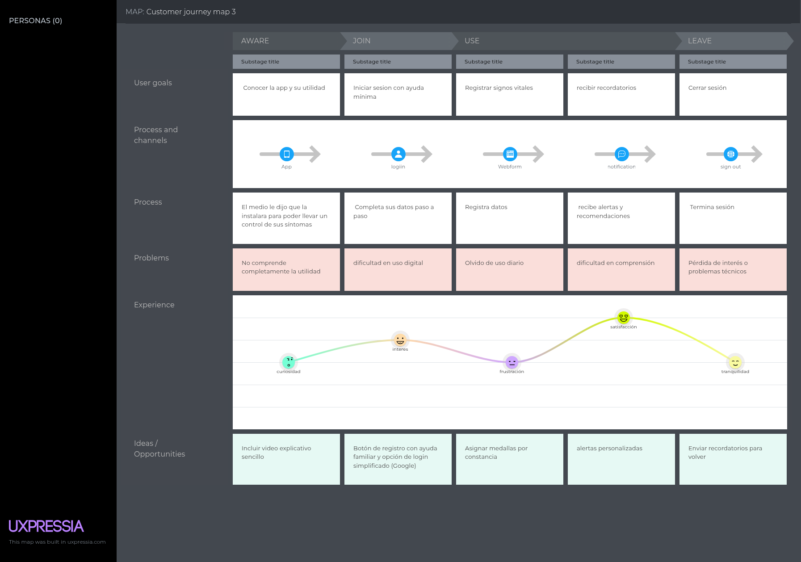

Segmento Objetivo: Doctores y personal médico

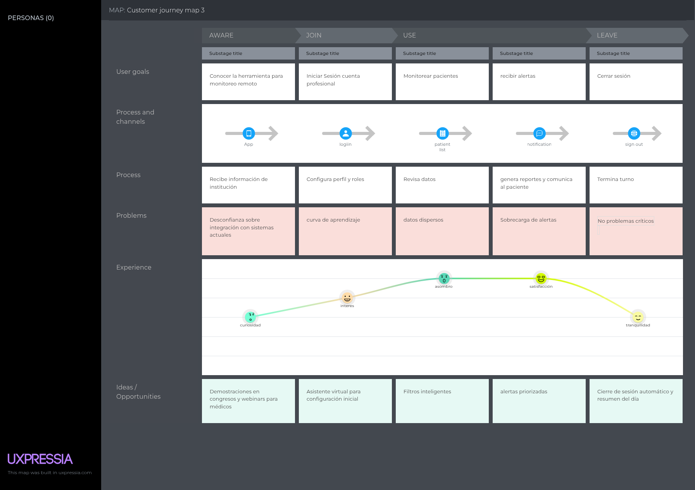

Segmento Objetivo: Administradores de instituciones de salud

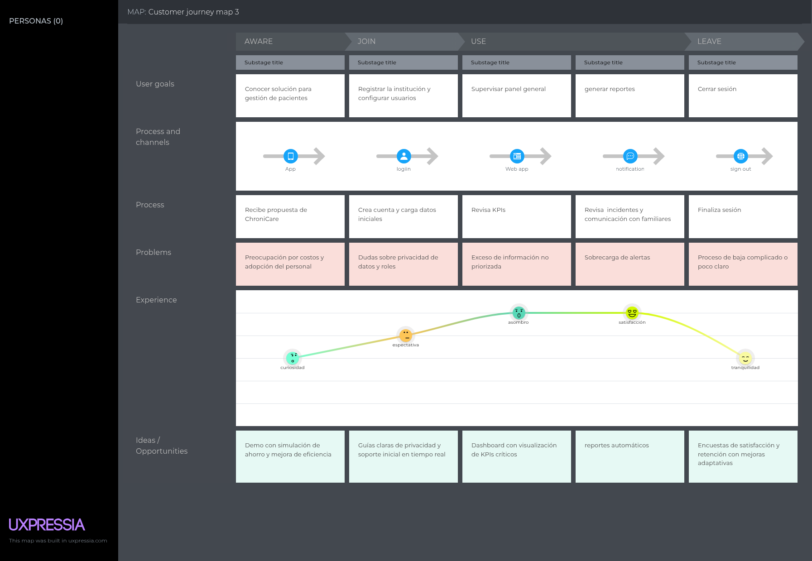

### 2.3.4. Empathy Mapping

Segmento Objetivo: Pacientes adultos mayores

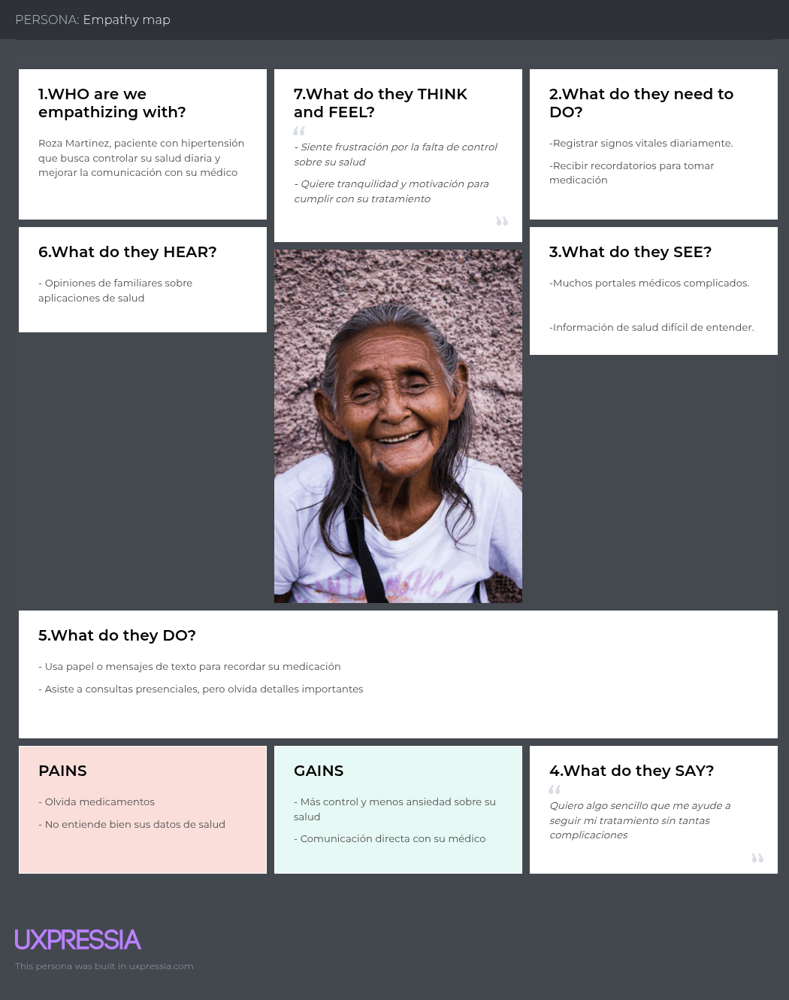

Segmento Objetivo: Doctores y personal médico

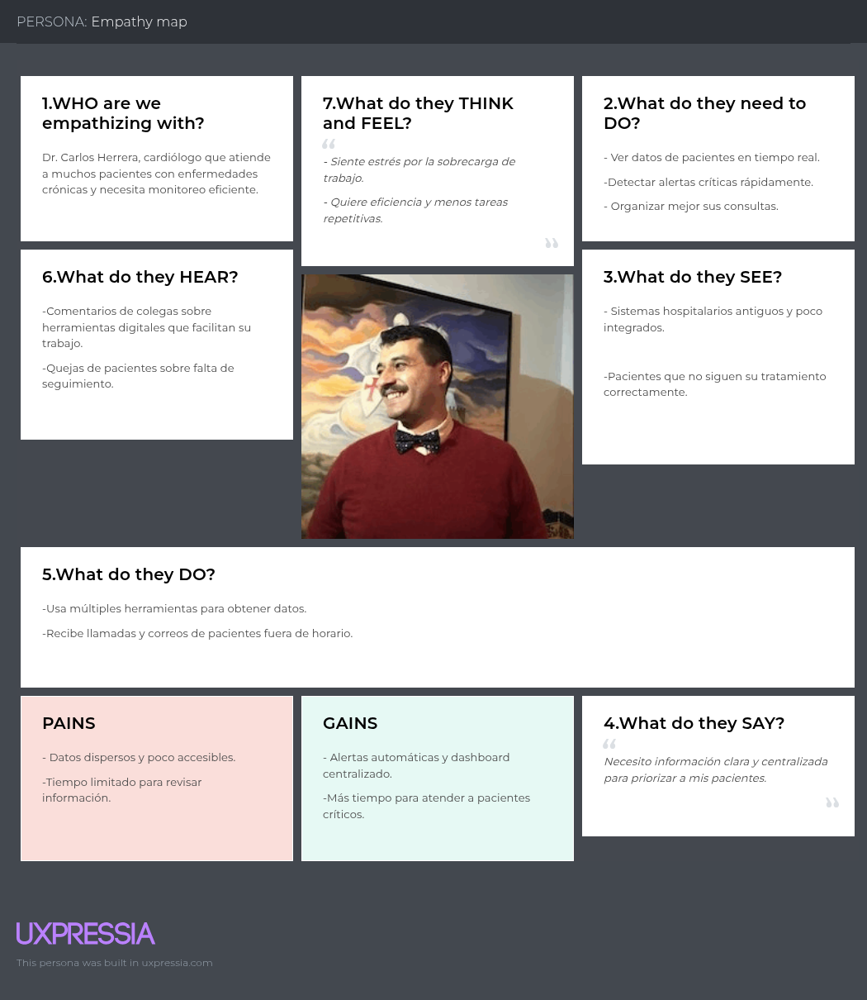

Segmento Objetivo: Administradores de instituciones de salud

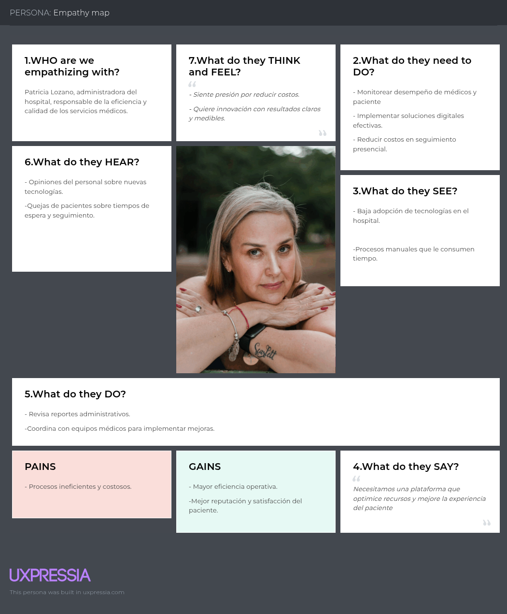

### 2.3.5. As-is Scenario Mapping

Segmento Objetivo: Pacientes adultos mayores

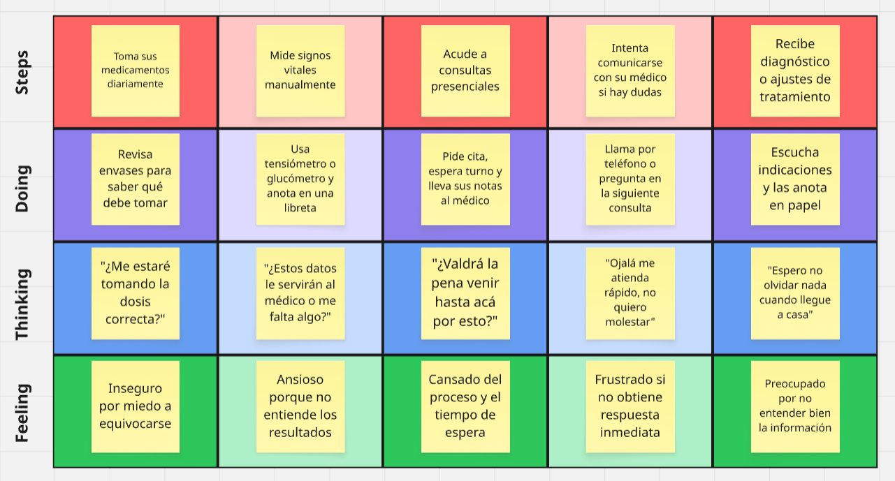

Segmento Objetivo: Doctores y personal médico

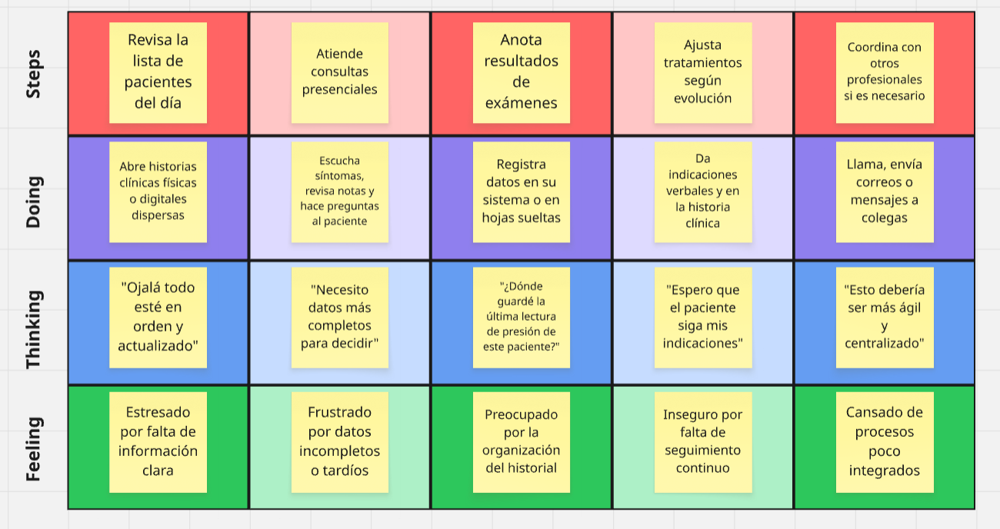

Segmento Objetivo: Administradores de instituciones de salud

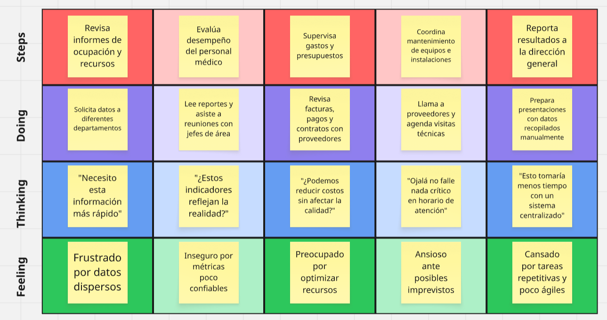

## 2.4. Ubiquitous Language

# Capítulo III: Requirements Specification
## 3.1. To-Be Scenario Mapping

## 3.2. User Stories

## 3.3. Impact Mapping

## 3.4. Product Backlog.

## 3.5. Entity Diagram.

# Capítulo IV: Product Design
## 4.1. Style Guidelines.

### 4.1.1. General Style Guidelines.

### 4.1.2. Web Style Guidelines.

## 4.2. Information Architecture.

### 4.2.1. Organization Systems.

### 4.2.2. Labeling Systems.

### 4.2.3. SEO Tags and Meta Tags

### 4.2.4. Searching Systems.

### 4.2.5. Navigation Systems.

## 4.3. Landing Page UI Design.

### 4.3.1. Landing Page Wireframe.

### 4.3.2. Landing Page Mock-up.

## 4.4. Web Applications UX/UI Design.
### 4.4.1. Web Applications Wireframes.

### 4.4.2. Web Applications Wireflow Diagrams.

### 4.4.3. Web Applications Mock-ups.

### 4.4.4. Web Applications User Flow Diagrams.

## 4.5. Web Applications Prototyping.

## 4.6. Domain-Driven Software Architecture.
### 4.6.1. Software Architecture Context Diagram.

### 4.6.2. Software Architecture Container Diagrams.

### 4.6.3. Software Architecture Components Diagrams.

## 4.7. Software Object-Oriented Design.
### 4.7.1. Class Diagrams.

### 4.7.2. Class Dictionary.

## 4.8. Database Design.
### 4.8.1. Database Diagram.

# Capítulo V: Product Implementation, Validation & Deployment
## 5.1. Software Configuration Management.

### 5.1.1. Software Development Environment Configuration.

### 5.1.2. Source Code Management.

### 5.1.3. Source Code Style Guide & Conventions.

### 5.1.4. Software Deployment Configuration.

## 5.2. Landing Page, Services & Applications Implementation.

## 5.2.1. Sprint 1
### 5.2.1.1. Sprint Planning 1.
### 5.2.1.2. Aspect Leaders and Collaborators.
### 5.2.1.3. Sprint Backlog 1.
### 5.2.1.4. Development Evidence for Sprint Review.
### 5.2.1.5. Execution Evidence for Sprint Review.
### 5.2.1.6. Services Documentation Evidence for Sprint Review.
### 5.2.1.7. Software Deployment Evidence for Sprint Review.
### 5.2.1.8. Team Collaboration Insights during Sprint.
